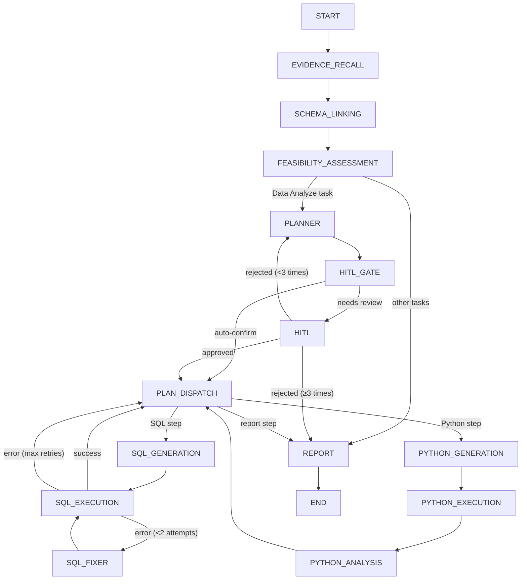

# 📊 Must Be The SQL

<p align="center">
  
  
  
  
  
  
  
  
</p>

<p align="center">
  <b>🧠 AI-powered SQL Agent backend — StateGraph-based multi-step reasoning engine with Human-in-the-Loop</b>
</p>

<p align="center">
  <a href="./README.zh-CN.md">🇨🇳 中文文档</a> |
  <a href="#quick-start">⚡ Quick Start</a> |
  <a href="https://github.com/shixia9/MustBeTheSQL">Client</a>
</p>

---

## 📖 Overview

**SQL Logic Engine Backend** is a Spring Boot 3.2 service that combines a traditional SQL workspace backend with a **StateGraph-based AI Agent engine** (via `graph-core`, the Java port of LangGraph). Users describe their data needs in natural language; the Agent autonomously retrieves knowledge, explores the database schema, plans multi-step execution, generates and fixes SQL (or Python scripts), and presents a consolidated report — **all with optional human oversight at critical decision points**.

---

## 🧠 SQL Agent — StateGraph Architecture

The Agent engine is a directed graph of **14 nodes** connected by conditional edges, executed by `SqlAgentRunner` with checkpoint-based pause/resume via `MemorySaver`.



### Agent Node Pipeline

| Node | Role | Detail |
|------|------|--------|
| **EVIDENCE_RECALL** 🔍 | Knowledge Retriever | Rewrites user query into standalone form; performs **two-channel RAG** over pgvector (glossary terms + few-shot Q/A pairs), partitioned by `userId` + `connectionId` |
| **SCHEMA_LINKING** 🔗 | Schema Context Builder | Expands table set via foreign-key relations; builds DDL + FK expressions + data samples; uses an LLM **mix-selector** to filter only relevant tables |
| **FEASIBILITY_ASSESSMENT** ✅ | Task Classifier | Determines if the request is an "data analysis" task (multi-step execution) or a simple question/chat |
| **PLANNER** 📋 | Multi-step Planner | Generates a structured JSON execution plan (SQL generation, Python analysis, report) based on schema + evidence |
| **HITL_GATE** 🚦 | Review Gate | LLM-based gate that decides if the plan needs human review; **auto-confirm mode** skips this entirely |
| **HITL** 👤 | Human-in-the-Loop | Pauses graph execution via `interruptBefore`; waits for the frontend to submit approval/rejection + optional feedback |
| **PLAN_DISPATCH** 🧭 | Step Router | Routes to the next execution tool based on the plan's current step |
| **SQL_GENERATION** → **SQL_EXECUTION** → **SQL_FIXER** | SQL Tool Chain | Generate SQL → execute on connected DB → auto-fix on error (up to 2 retries) — loops back through the dispatcher for multi-step plans |
| **PYTHON_GENERATION** → **PYTHON_EXECUTION** → **PYTHON_ANALYSIS** | Python Sandbox Chain | Generate Python scripts → execute in isolated sandbox → produce analysis conclusions |
| **REPORT** ◉ | Report Generator | Synthesizes all execution results + analysis into a final Markdown report |

### Key Features

- **Streaming SSE**: Each node's result streams to the frontend as `Server-Sent Events` in real time
- **Human-in-the-Loop**: Plans are paused at the HITL node; then shows an approval card with full plan context. Users can approve, reject (→ re-plan), or provide modification feedback
- **SQL Auto-Repair**: When SQL execution fails, `SqlFixerNode` analyzes the error and retries (up to 2 times)
- **Python Sandbox**: Analytical tasks run Python scripts in a `SimplePythonExecutor` sandbox (subprocess isolation), with results fed back into the report
- **RAG Knowledge**: Business glossary and few-shot Q/A pairs are stored in pgvector; `EvidenceRecallNode` retrieves relevant knowledge per query
- **Multi-Dialect**: Automatically detects MySQL vs PostgreSQL dialect from the connection config

---

## 🏗️ Module Structure

```
sql-logic-engine-be/
├── sql-logic-common/          # Shared DTOs, exceptions, utilities
│   ├── dto/                   #  Request/Response DTOs
│   ├── exception/             #  BizException, Result wrapper
│   └── util/                  #  PasswordUtil, UrlValidationUtil
├── sql-logic-service/         # Core business logic + Agent engine
│   ├── application/           #  High-level app services
│   │   └── service/           #   SQL execute, generate, vector search, etc.
│   ├── domain/
│   │   ├── agent/             #    SQL Agent engine
│   │   │   ├── core/          #    SqlAgentRunner, AiAgentManager, HitlSessionRegistry
│   │   │   ├── node/          #    14 StateGraph nodes
│   │   │   ├── edge/          #    Conditional routing edges
│   │   │   ├── dto/           #    Agent-specific DTOs
│   │   │   ├── prompt/        #    Prompt template management (.st files)
│   │   │   ├── strategy/      #    LLM provider strategy pattern
│   │   │   └── python/        #    Python sandbox executor
│   │   ├── conversation/      #  Conversation history aggregate
│   │   └── database/          #  Database connection entity
│   ├── infrastructure/        #  DAO, AOP, annotation
│   └── trigger/http/          #  REST controllers
└── sql-logic-gateway/         # API Gateway (Spring Cloud Gateway + Nacos)
```

---

## ✨ Platform Features

Beyond the Agent engine, the backend provides:

### 🔌 Database Management
- **Multi-tenant** connection management with connection isolation via HikariCP
- Supports **MySQL** and **PostgreSQL**
- SPI-style **dialect abstraction** for easy extension to new databases
- **Connection validation chain**: access control, safety checks, token quota enforcement

### 🛡️ SQL Execution Safety
- **Multi-layer validation** chain before any SQL execution:
  - SQL safety validator (blocks destructive operations like unqualified DELETE/UPDATE)
  - Console SQL safety validator
  - User status validator (disabled users blocked)
  - Token quota validator (rate limiting)
- **SQL audit logging** via AOP (`@RecordSqlAudit`)
- **JSQLParser**-based statement parsing & categorization

### 📊 Schema Discovery
- Full database metadata introspection (schemas, tables, columns, indexes, primary keys)
- DDL auto-generation (`CREATE TABLE` / `VIEW`)
- **Foreign-key relation extraction** for schema linking
- **Column data sampling** for LLM context enrichment

### 🔐 Authentication & Authorization
- **Sa-Token**-based session management
- JWT-style token authentication
- Role-based access control (disabled/enabled user status)
- Password hashing with BCrypt-compatible algorithm

---

## 🚀 Quick Start

### Prerequisites

- JDK 21
- Maven 3.8+
- MySQL / PostgreSQL
- Nacos (for configuration center)
- pgvector (optional, for RAG features)

### 1. Clone the repository

```bash
git clone https://github.com/shixia9/MustBeTheSQL-Server.git
cd MustBeTheSQL-Server
```

### 2. Configure the database

Copy `application-local.yml.example` to `application-local.yml` and fill in your database credentials, LLM API keys, and Nacos address.

### 3. Start the service

```bash
# Build the project
mvn clean install -DskipTests

# Start the service module (includes embedded Tomcat)
mvn spring-boot:run -pl sql-logic-service
```

### 4. (Optional) Start with Gateway

```bash
# Start Nacos first, then:
mvn spring-boot:run -pl sql-logic-gateway
mvn spring-boot:run -pl sql-logic-service
```

### 5. Start with Docker Compose

```bash
docker-compose -f docker-compose-local.yml up -d
```

---

## 🔧 Configuration

Key configuration files are in `sql-logic-service/src/main/resources/`:

| File | Purpose |
|------|---------|
| `application.yml` | Base config (datasource, mybatis, LLM providers) |
| `application-local.yml` | Local overrides (credentials, API keys) |
| `bootstrap.yml` | Nacos bootstrap config |
| `prompts/*.st` | **LLM prompt templates** (14 templates for all agent nodes) |

---

## 📡 API Endpoints

| Endpoint | Method | Purpose |
|----------|--------|---------|
| `/api/v1/agent/sql/stream` | POST | Start an Agent run (SSE streaming) |
| `/api/v1/agent/sql/continue` | POST | Resume a paused HITL session (SSE) |
| `/api/v1/sql/generate` | POST | Direct SQL generation (non-agent) |
| `/api/v1/sql/execute` | POST | Execute SQL on a connected database |
| `/api/v1/sql/console/execute` | POST | SQL console execution |
| `/api/v1/database/**` | Various | Database connection CRUD + metadata |
| `/api/v1/workspace/**` | Various | Workspace management |
| `/api/v1/conversation/**` | Various | Chat history CRUD |
| `/api/v1/user/**` | Various | User registration, login, profile |
| `/api/v1/llm-config/**` | Various | LLM configuration management |
| `/api/v1/business-knowledge/**` | Various | Business glossary + knowledge base CRUD |

---

## 🧪 Project Status

- ✅ **Phase 1**: Single LLM call NL2SQL
- ✅ **Phase 2**: Schema Linking — FK expansion + LLM table filtering + data sampling
- ✅ **Phase 3**: Feasibility Assessment + Planner + Plan Dispatch with SQL/Python tool loops
- ✅ **Phase 4**: Human-in-the-Loop (HITL) — interrupt/resume via StateGraph checkpoints
- ✅ **Phase 5**: RAG Knowledge — pgvector two-channel retrieval (glossary + few-shot Q/A)
- 🚧 **Future**: Semantic model integration, multi-turn conversation memory, advanced Python analysis
