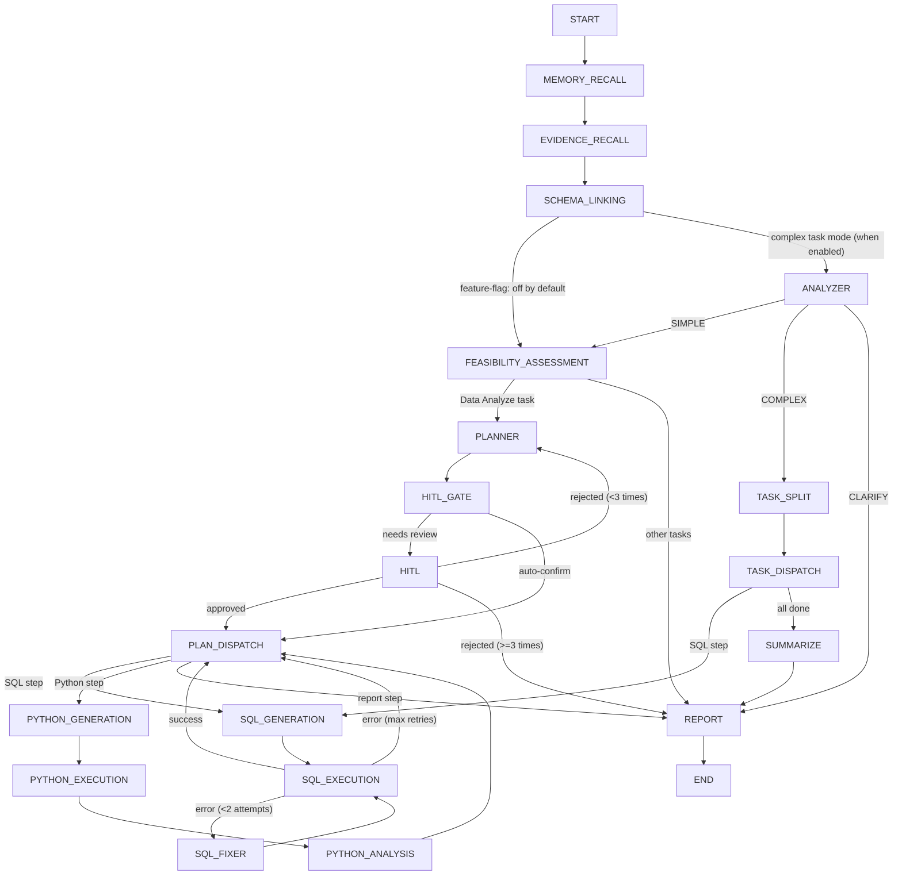

# 📊 Must Be The SQL

<p align="center">
  
  
  
  
  
  
  
  
</p>

<p align="center">
  <b>NL2SQL Agent backend — StateGraph reasoning engine + LLM high availability + MCP tool ecosystem + Multi-tenant workspaces</b>
</p>

<p align="center">
  <a href="./README.zh-CN.md">🇨🇳 中文文档</a> |
  <a href="#quick-start">⚡ Quick Start</a> |
  <a href="https://github.com/shixia9/MustBeTheSQL">Client</a>
</p>

---

## 📖 Overview

**SQL Logic Engine Backend** is an enterprise-grade AI Agent platform built on Spring Boot 3.2. It combines a traditional SQL workspace backend with a **StateGraph-based AI Agent engine** (via `graph-core`, the Java port of LangGraph). Users describe their data needs in natural language; the Agent autonomously retrieves knowledge, explores the database schema, plans multi-step execution, generates and fixes SQL (or Python scripts), and presents a consolidated report — **all with optional human oversight at critical decision points**.

### Capability Matrix

| Domain | Features |
|--------|----------|
| **Multi-Tenant Workspaces** | User → Workspace two-level isolation, 4-tier roles (OWNER/ADMIN/MEMBER/VIEWER) |
| **Agent Engine** | 18-node StateGraph, simple query / complex multi-step dual mode, Human-in-the-Loop (HITL) |
| **LLM High Availability** | 4 load-balancing strategies + circuit breaker + fallback chain + session affinity + metrics |
| **Long-Term Memory** | SHA256 dedup + pgvector vector search + auto extraction/injection + weighted ranking |
| **Conversation Context** | Multi-turn follow-up + sliding window + LLM summarization (SUMMARIZE) |
| **Agent Studio** | Customizable Agent (system prompt/tool toggles/RAG params/memory/context strategy) |
| **RAG Knowledge** | pgvector dual-channel retrieval (glossary terms + few-shot Q/A pairs) |
| **Python Sandbox** | Docker-isolated Python script execution |
| **Tool Ecosystem** | BUILTIN tools + MCP protocol (SSE/Stdio) for external tool integration |
| **Admin Dashboard** | Standalone admin module (user management/LLM monitoring/quota adjustment) |
| **Security** | 5-layer SQL validation chain + audit logging + rate limiting |
| **Observability** | Execution tracing (TraceContext) + per-step token/latency + real-time SSE streaming |
| **SSO** | GitHub OAuth login |

---

## 🧠 SQL Agent — StateGraph Architecture

The Agent engine is a directed graph of **18 nodes** connected by conditional edges, executed by `SqlAgentRunner` with checkpoint-based pause/resume via `MemorySaver`.



### Agent Node Pipeline

| Node | Role | Detail |
|------|------|--------|
| **MEMORY_RECALL** 🧠 | Memory Retriever | Retrieves user's Top-5 long-term memories from pgvector, injects into downstream prompts |
| **EVIDENCE_RECALL** 🔍 | Knowledge Retriever | Rewrites user query into standalone form; performs **dual-channel RAG** over pgvector (glossary terms + few-shot Q/A pairs) |
| **SCHEMA_LINKING** 🔗 | Schema Context Builder | Expands table set via foreign-key relations; builds DDL + FK expressions + data samples; uses an LLM mix-selector to filter relevant tables |
| **ANALYZER** 🔬 | Complexity Analyzer | Classifies task complexity (SIMPLE/COMPLEX/CLARIFY); routes COMPLEX to task-split branch |
| **FEASIBILITY_ASSESSMENT** ✅ | Task Classifier | Determines if the request is a "data analysis" task (multi-step execution) or simple question/chat |
| **PLANNER** 📋 | Multi-step Planner | Generates a structured JSON execution plan based on schema + evidence |
| **TASK_SPLIT** ✂️ | Task Splitter | Decomposes complex analysis into subtasks, persists to agent_subtask table |
| **HITL_GATE** 🚦 | Review Gate | LLM-based gate that decides if the plan needs human review; **auto-confirm mode** skips this |
| **HITL** 👤 | Human-in-the-Loop | Pauses graph execution via `interruptBefore`; waits for frontend approval/rejection + feedback |
| **PLAN_DISPATCH** 🧭 | Step Router | Routes to the next execution tool based on the plan's current step |
| **TASK_DISPATCH** 📤 | Subtask Scheduler | Sequentially dispatches subtasks by CURRENT_SUBTASK pointer |
| **SQL_GENERATION** → **SQL_EXECUTION** → **SQL_FIXER** | SQL Tool Chain | Generate SQL → execute on connected DB → auto-fix on error (up to 2 retries) |
| **PYTHON_GENERATION** → **PYTHON_EXECUTION** → **PYTHON_ANALYSIS** | Python Sandbox Chain | Generate Python scripts → execute in Docker-isolated sandbox → produce analysis conclusions |
| **SUMMARIZE** 📝 | Result Summarizer | LLM-based aggregation of all subtask results |
| **REPORT** ◉ | Report Generator | Synthesizes all execution results + analysis + memory preferences into a final Markdown report |

### Key Features

- **Streaming SSE**: Each node's result streams to the frontend as `Server-Sent Events` in real time
- **Human-in-the-Loop**: Plans are paused at the HITL node; approval card with full plan context. Users can approve, reject (→ re-plan), or provide modification feedback
- **SQL Auto-Repair**: When SQL execution fails, `SqlFixerNode` analyzes the error and retries (up to 2 times)
- **Python Sandbox**: Analytical tasks run Python scripts in a Docker container, with results fed back into the report
- **Multi-Turn Conversations**: Conversation context accumulates automatically; supports follow-up questions like "break down the above result by city"
- **Customizable Agents**: Configure system prompts, tool toggles, RAG parameters, and memory strategy via Agent Studio
- **RAG Knowledge**: Business glossary and few-shot Q/A pairs are stored in pgvector; `EvidenceRecallNode` retrieves relevant knowledge per query
- **Multi-Dialect**: Automatically detects MySQL vs PostgreSQL dialect from the connection config

### MCP Tool

MCP external tools operate at the tool abstraction layer:

- `ToolRegistry` manages both BUILTIN and MCP tool registrations in one place
- `AgentToolGate` provides a one-liner check at each node's entry point
- MCP server connect/disconnect/tool discovery is handled by `McpServerManager`, transparent to the StateGraph

> The same 18-node graph can drive **any number** of tools — whether built-in or externally connected via MCP.

---

## 🏗️ Module Structure

```
sql-logic-engine-be/
├── sql-logic-common/          # Shared DTOs, exceptions, utilities, Dubbo interfaces
│   ├── dto/                   #  Request/Response DTOs
│   ├── dubbo/                 #  Admin RPC interface definitions
│   ├── exception/             #  BizException, Result wrapper
│   └── util/                  #  PasswordUtil, UrlValidationUtil
├── sql-logic-service/         # Core business logic + Agent engine
│   ├── application/           #  High-level app services
│   │   └── service/           #   SQL execute, generate, vector search, Agent CRUD, admin
│   ├── domain/
│   │   ├── agent/             #    SQL Agent engine
│   │   │   ├── core/          #    SqlAgentRunner, AiAgentManager, HitlSessionRegistry
│   │   │   ├── config/        #    AgentRuntimeConfig, Graph topology config
│   │   │   ├── node/          #    18 StateGraph nodes
│   │   │   ├── edge/          #    Conditional routing edges
│   │   │   ├── ha/            #    LLM High Availability module
│   │   │   │   ├── circuit/   #    Circuit breaker
│   │   │   │   └── strategy/  #    Load balancing strategies (4 types)
│   │   │   ├── tool/          #    Tool abstraction + MCP integration
│   │   │   │   └── mcp/       #    MCP SSE/Stdio transport
│   │   │   ├── prompt/        #    Prompt template management (18 .st files)
│   │   │   ├── strategy/      #    LLM provider strategy pattern
│   │   │   └── python/        #    Python sandbox executor
│   │   ├── conversation/      #  Conversation history + context window management
│   │   ├── database/          #  Database connection entity
│   │   ├── memory/            #  Long-term memory (dedup/search/extract)
│   │   ├── trace/             #  Execution tracing
│   │   ├── oauth/             #  GitHub OAuth integration
│   │   └── workspace/         #  Multi-tenant workspace + permission assertions
│   ├── infrastructure/        #  DAO, AOP, annotation, interceptors, health, rate limiting
│   └── trigger/http/          #  REST controllers
│       └── admin/             #  Admin management controllers
├── sql-logic-admin/           # Standalone admin module (Spring Boot + Dubbo)
│   ├── controller/            #  Admin REST API
│   ├── service/               #  Admin business logic
│   └── interceptor/           #  AdminGuard interceptor
└── sql-logic-gateway/         # API Gateway (Spring Cloud Gateway + Nacos + Sa-Token)
```

---

## ✨ Platform Features

### 🔌 Database Management
- **Multi-tenant** connection management with connection isolation via HikariCP, workspace-level binding
- Supports **MySQL** and **PostgreSQL**
- SPI-style **dialect abstraction** for easy extension to new databases
- **Connection validation chain**: access control, safety checks, token quota enforcement

### 🛡️ SQL Execution Safety
- **Multi-layer validation** chain before any SQL execution:
  - SQL safety validator (blocks destructive operations like unqualified DELETE/UPDATE)
  - Console SQL safety validator
  - User status validator (disabled users blocked)
  - Token quota validator (rate limiting)
- **SQL audit logging** via AOP (`@RecordSqlAudit`)
- **JSQLParser**-based statement parsing & categorization
- Optional **rate limiting**: 30 requests/min per user (RateLimitFilter, disabled by default)

### 👥 Multi-Tenant Workspaces
- User → **Workspace** two-level resource isolation
- **4-tier role model**: OWNER / ADMIN / MEMBER / VIEWER
- Workspace-scoped resources: DB connections, conversations, knowledge bases, Agent executions
- Backward compatible: omit `workspaceId` to fall back to user-level isolation

### 🧠 Memory System
- **Four memory types**: PROFILE (preferences), TASK (task patterns), FACT (business knowledge), EPISODIC (session context)
- **Auto-extraction**: Async extraction from conversation transcripts after each Agent execution
- **Smart injection**: Top-5 relevant memories automatically retrieved and injected into prompts
- **SHA256 dedup** + merge strategy (max importance, union tags)
- **Three trigger points**: auto on completion / HITL approval / manual API call

### 🎛️ Agent Studio
- **Agent customization**: system prompt, welcome message, tool toggles (sql/schema/python/sample)
- **RAG config**: Top-K, score threshold, context strategy (TRUNCATE/SUMMARIZE)
- **Memory toggle**: enable/disable memory injection per Agent
- **Version management**: manual snapshot publish, 7-day retention, one-click rollback
- **Workspace sharing**: Agent visibility scoped to workspace members

### ⚡ LLM High Availability
- **4 load balancing strategies**: Round-Robin / Latency-First / Success-Rate-First / Smart weighted scoring
- **Circuit breaker**: opens after 5 consecutive failures, 30s cooldown, half-open probing
- **Fallback chain**: user-configurable ordered list of backup LLM providers
- **Runtime failover**: per-request failover in seconds when primary fails
- **Metrics monitoring**: per-minute window aggregation (call volume, success rate, latency, token usage)
- **Session affinity**: same session bound to same instance to reduce context switching

### 🔧 MCP Tool Ecosystem

The system ships with 4 BUILTIN tools (sql / schema / python / sample) and supports connecting external tool servers via **MCP (Model Context Protocol)** for a pluggable, extensible tool ecosystem.

#### Tool Abstraction Layer

```
ToolDefinition (record)
  ├── name: String              -- Unique tool key ("sql", "schema", "python", "sample", or MCP-registered name)
  ├── displayName: String       -- Human-readable label
  ├── description: String       -- Functional description
  ├── type: ToolType            -- BUILTIN / MCP_SSE / MCP_STDIO / DOCKER_PYTHON
  └── parametersSchema: String  -- JSON Schema (MCP tool parameter definitions)

ToolRegistry (@Component)
  └── Registers 4 BUILTIN tools on startup
  └── Dynamically registers/unregisters MCP tools at runtime
```

#### MCP Transport Layer

Two standard MCP transport protocols are supported:

| Transport | Communication | Use Case |
|-----------|--------------|----------|
| **MCP SSE** | HTTP POST JSON-RPC | Remote MCP servers (e.g. third-party tool services) |
| **MCP Stdio** | Subprocess stdin/stdout JSON-RPC | Local MCP servers (e.g. CLI-based tools) |

#### Tool Registration Flow

```
User adds an MCP server
  → McpServerManager.addServer()
    → Create mcp_server_config record
    → Connect to MCP server (SSE/Stdio)
    → Call tools/list to discover tools
    → Register into ToolRegistry (namespace-prefixed to prevent collisions)
    → Agent Studio now shows the new tool as toggleable
```

#### AgentToolGate — Runtime Tool Gating

Agent Studio tool toggles control runtime behavior via `AgentToolGate.isToolEnabled(state, toolKey)`:

| toolKey | When Disabled |
|---------|---------------|
| `schema` | SchemaLinkingNode skips FK extraction + data sampling |
| `sample` | Skips ColumnSampleService sampling calls |
| `sql` | SqlExecutionNode outputs skip message, no SQL execution |
| `python` | PlannerNode injects constraint + PlanDispatchNode safety-net intercept |

MCP-registered external tools are gated through the same mechanism — no node code changes required.

### 📊 Observability
- **Execution tracing**: TraceContext per request, records per-step token/latency/output
- **Frontend visualization**: waterfall timeline chart + token stats + per-node timing
- **Health check**: `/actuator/health` covers LLM/DB/Redis status
- **Admin dashboard**: LLM monitoring panel + user management + usage statistics

### 🔐 Authentication & Authorization
- **Sa-Token** session management (Redis-backed)
- BCrypt-compatible password hashing
- **GitHub OAuth** SSO login
- Admin dashboard with independent auth (SUPER_ADMIN / ADMIN roles)

---

## 🚀 Quick Start

### Prerequisites

- JDK 21
- Maven 3.8+
- MySQL 8.0+
- PostgreSQL 14+ (pgvector extension, for RAG and memory)
- Redis (session management)
- Nacos (configuration center / service discovery)
- Docker (Python sandbox, optional)

### 1. Clone the repository

```bash
git clone https://github.com/shixia9/MustBeTheSQL-Server.git
cd MustBeTheSQL-Server
```

### 2. Configuration

Copy `application-local.yml.example` to `application-local.yml` and fill in your database credentials, LLM API keys, and Nacos address.

```bash
cp sql-logic-service/src/main/resources/application-local.yml.example \
   sql-logic-service/src/main/resources/application-local.yml
```

### 3. Database initialization

Core tables include:
- Auth: `user_info`, `admin_user`
- Multi-tenancy: `workspace`, `workspace_member`
- Agents: `agent_entity`, `agent_version`
- LLM: `user_llm_config`, `llm_call_metrics`
- Conversations: `conversation`, `conversation_detail`, `agent_execution`, `agent_execution_step`
- Memory: `memory_item`
- Tools: `mcp_server_config`
- Subtasks: `agent_subtask`

### 4. Start the services

```bash
# Build the project
mvn clean install -DskipTests

# Start Nacos, MySQL, Redis, PostgreSQL

# Start the gateway
mvn spring-boot:run -pl sql-logic-gateway

# Start the core service
mvn spring-boot:run -pl sql-logic-service

# (Optional) Start the admin module
mvn spring-boot:run -pl sql-logic-admin
```

### 5. Start with Docker Compose

```bash
docker-compose -f docker-compose-local.yml up -d
```

---

## 🔧 Configuration

Key configuration files are in `sql-logic-service/src/main/resources/`:

| File | Purpose |
|------|---------|
| `application.yml` | Base config (datasource, mybatis, LLM providers) |
| `application-local.yml` | Local overrides (credentials, API keys) |
| `bootstrap.yml` | Nacos bootstrap config |
| `prompts/*.st` | **LLM prompt templates** (18 templates for all Agent nodes + memory/summarization) |

### Feature Flags

| Config Key | Default | Description |
|------------|---------|-------------|
| `phase-b.task-split.enabled` | `false` | Enable ANALYZER → TASK_SPLIT complex task decomposition |
| `agent.rate-limit.enabled` | `false` | Enable rate limiting on Agent endpoint (30 req/min/user) |
| `oauth.github.client-id` | — | Configure GitHub OAuth SSO (auto-shows login button when set) |

---

## 📡 API Endpoints

### Agent & SQL

| Endpoint | Method | Purpose |
|----------|--------|---------|
| `/api/v1/agent/sql/stream` | POST | Start an Agent run (SSE streaming) |
| `/api/v1/agent/sql/continue` | POST | Resume a paused HITL session (SSE) |
| `/api/v1/sql/execute` | POST | Execute SQL on a connected database |
| `/api/v1/sql/console/execute` | POST | SQL console execution |

### Workspaces

| Endpoint | Method | Purpose |
|----------|--------|---------|
| `/api/v1/workspaces` | GET / POST | List / create workspaces |
| `/api/v1/workspaces/{id}` | PUT / DELETE | Update / delete a workspace |
| `/api/v1/workspaces/{id}/members` | GET / POST | List / invite members |
| `/api/v1/workspaces/{id}/members/{userId}` | PUT / DELETE | Change role / remove member |

### Agent Studio

| Endpoint | Method | Purpose |
|----------|--------|---------|
| `/api/v1/agent-entity/list` | GET | List Agents (including workspace-shared) |
| `/api/v1/agent-entity` | POST | Create an Agent |
| `/api/v1/agent-entity/{id}` | GET / PUT / DELETE | View / edit / delete Agent |
| `/api/v1/agent-entity/{id}/default` | PUT | Set as default Agent |
| `/api/v1/agent-entity/{id}/publish` | POST | Publish version snapshot |
| `/api/v1/agent-entity/{id}/versions` | GET | Version history |
| `/api/v1/agent-entity/{id}/versions/{vid}/revert` | POST | Rollback to version |

### LLM Config & HA

| Endpoint | Method | Purpose |
|----------|--------|---------|
| `/api/v1/llm-config` | GET / POST | List / add LLM configs |
| `/api/v1/llm-config/{id}` | PUT / DELETE | Update / delete config |
| `/api/v1/llm-config/{id}/test` | POST | Test LLM connectivity |
| `/api/v1/llm-config/{id}/strategy` | PUT | Update HA strategy + fallback chain |
| `/api/v1/llm-config/{id}/metrics` | GET | View LLM metrics |

### Memory

| Endpoint | Method | Purpose |
|----------|--------|---------|
| `/api/v1/memory/list` | GET | List memories (filter by type) |
| `/api/v1/memory` | POST | Manually create a memory |
| `/api/v1/memory/{id}` | DELETE | Delete a memory |
| `/api/v1/memory/extract` | POST | Manually trigger memory extraction |

### Conversations

| Endpoint | Method | Purpose |
|----------|--------|---------|
| `/api/v1/conversations/user/{userId}/summaries` | GET | Paginated conversation summary list |

### MCP Tools

| Endpoint | Method | Purpose |
|----------|--------|---------|
| `/api/v1/tools` | GET | List registered tools |
| `/api/v1/mcp-servers` | GET / POST | List / add MCP servers |
| `/api/v1/mcp-servers/{id}` | DELETE | Remove MCP server |
| `/api/v1/mcp-servers/{id}/connect` | POST | Reconnect |
| `/api/v1/mcp-servers/{id}/disconnect` | POST | Disconnect |
| `/api/v1/mcp-servers/{id}/status` | GET | Connection status |

### Other

| Endpoint | Method | Purpose |
|----------|--------|---------|
| `/api/v1/database/**` | Various | Database connection CRUD + metadata |
| `/api/v1/schema/**` | Various | Schema browser (tables/columns/indexes/DDL) |
| `/api/v1/user/**` | Various | User registration, login, profile |
| `/api/v1/user/admin-check` | GET | Check if current user is an admin |
| `/api/v1/business-knowledge/**` | Various | Business glossary + knowledge base CRUD |
| `/api/v1/oauth/github/status` | GET | Check if GitHub OAuth is configured |
| `/api/v1/oauth/github/authorize` | GET | Redirect to GitHub authorization |
| `/api/v1/admin/**` | Various | Admin dashboard API (requires ADMIN role) |
| `/actuator/health` | GET | Health check |

---

## 🧪 Project Phases

### Completed

- ✅ **Phase 1**: Single LLM call NL2SQL
- ✅ **Phase 2**: Schema Linking — FK expansion + LLM table filtering + data sampling
- ✅ **Phase 3**: Feasibility Assessment + Planner + Plan Dispatch with SQL/Python tool loops
- ✅ **Phase 4**: Human-in-the-Loop (HITL) — interrupt/resume via StateGraph checkpoints
- ✅ **Phase 5**: RAG Knowledge — pgvector dual-channel retrieval (glossary + few-shot Q/A)
- ✅ **Phase A**: Multi-tenant workspaces + Execution tracing + LLM Provider management UI + Message type classification
- ✅ **Phase B**: LLM HA (4 strategies + circuit breaker + fallback) + Agent state machine upgrade + Memory system + Agent Studio + Conversation context
- ✅ **Phase C**: Tool gate closure + Context summarization strategy + Conversation persistence + Admin dashboard + Rate limiting/Health check
- ✅ **Phase D**: MCP tool ecosystem (Tool abstraction + SSE/Stdio transport) + Agent versioning + Workspace sharing + GitHub OAuth SSO
- 🚧 **Phase E**: Frontend closure — MCP management page + Agent version UI + Dynamic tool loading + Workspace ownership visualization
