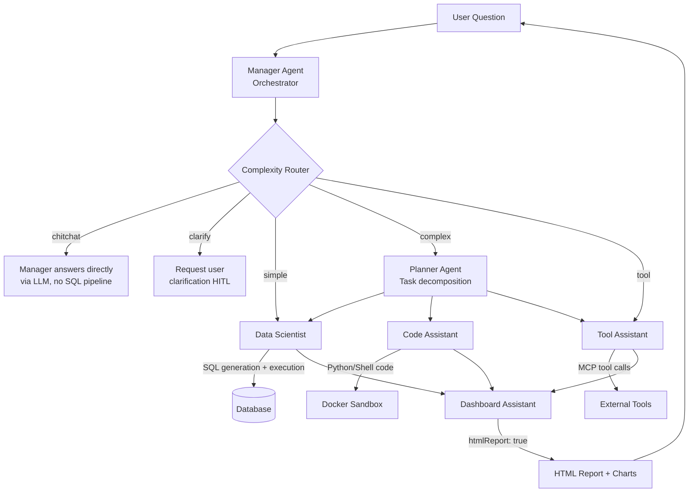
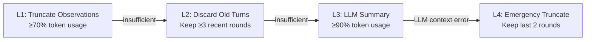

# Must Be The SQL

<p align="center">
  
  
  
  
  
  
  
</p>

<p align="center">
  <b>Multi-Agent NL2SQL platform — Autonomous data analysis with LLM thinking, context compression & sandboxed execution</b>
</p>

<p align="center">
  <a href="./README.zh-CN.md">中文</a> |
  <a href="https://github.com/shixia9/MustBeTheSQL">Frontend</a> |
  <a href="#quick-start">Quick Start</a> |
  <a href="#architecture">Architecture</a>
</p>

---

<!-- 主页截图 -->


---

## What is Must Be The SQL?

Must Be The SQL is an AI data assistant that connects to your databases, understands natural-language questions, and autonomously performs data analysis end-to-end.

Users describe their data needs in plain language. A team of specialised AI agents — each with its own LLM thinking process — collaborates to explore the database schema, plan multi-step execution, generate and fix SQL, run Python analysis in a sandbox, and deliver a consolidated report.

### Key Capabilities

- **Multi-Agent collaboration** — A Manager agent orchestrates specialist agents (Data Scientist, Code Assistant, Tool Assistant, Dashboard Assistant), each with autonomous decision-making
- **Progressive context compression** — Four-layer strategy (L1–L4) keeps conversations within token budgets without losing critical context
- **Sandboxed code execution** — Python/Shell scripts run in Docker-isolated sandboxes with security validation
- **Multi-turn conversations** — Context accumulates across turns with automatic summarisation and memory injection
- **MCP tool ecosystem** — Built-in tools plus Model Context Protocol support for external tool integration
- **Human-in-the-Loop** — Optional plan approval gate before execution, with auto-confirm mode
- **Multi-tenant workspaces** — User → Workspace isolation with 4-tier roles
- **LLM high availability** — Load balancing, circuit breaker, fallback chain, session affinity

---

## Architecture

### Multi-Agent System

The platform uses a multi-agent architecture where a **Manager** agent receives user requests and dispatches tasks to specialised worker agents. Each agent has its own LLM strategy, memory, and action set.


```mermaid
flowchart TB
    User[User Question] --> Manager[Manager Agent<br/>Orchestrator]

    Manager --> Router{Complexity Router}

    Router -->|chitchat| Chitchat[Manager answers directly<br/>via LLM, no SQL pipeline]
    Router -->|clarify| Clarify[Request user<br/>clarification HITL]
    Router -->|simple| DS[Data Scientist]
    Router -->|complex| Planner[Planner Agent<br/>Task decomposition]
    Router -->|tool| TA[Tool Assistant]

    Planner --> DS
    Planner --> CA[Code Assistant]
    Planner --> TA

    DS -->|SQL generation + execution| DB[(Database)]
    CA -->|Python/Shell code| Sandbox[Docker Sandbox]
    TA -->|MCP tool calls| ExtTools[External Tools]

    DS & CA & TA --> Dashboard[Dashboard Assistant]
    Dashboard -->|htmlReport: true| Report[HTML Report + Charts]
    Report --> User
```

### Agent Roles

| Agent | Role | Capabilities |
|-------|------|-------------|
| **Manager** | Orchestrator | Receives user request, routes by complexity, coordinates worker agents, aggregates results |
| **Planner** | Task Planner | Decomposes complex requests into structured execution plans with step-by-step assignment |
| **Data Scientist** | SQL Expert | Multi-candidate SQL generation, execution, auto-repair, chart visualisation |
| **Code Assistant** | Code Engineer | Python/Shell code generation, sandbox execution, data analysis |
| **Tool Assistant** | Tool Specialist | MCP external tool discovery and invocation |
| **Dashboard Assistant** | Report Generator | Synthesises execution results into HTML reports, dashboards, and summaries |

### Routing Paths

The Manager Agent classifies each request and routes it through one of five paths:

| Path | Trigger | Behaviour |
|------|---------|-----------|
| **Tool Invocation** | User picked a tool from the `/` command palette | Routes directly to Tool Assistant, skips complexity assessment |
| **Chitchat** | Greetings, general-knowledge, capability questions | Manager answers directly via LLM — no SQL pipeline, no report |
| **Clarify** | Question is ambiguous or missing critical info | Requests user clarification (HITL gate when enabled) |
| **Simple** | A single SQL can answer | Direct to Data Scientist (skip Planner), then text summary (no HTML report) |
| **Complex** | Report/chart/multi-step analysis needed | Planner → Workers → Dashboard full pipeline (HTML report) |

### Inter-Agent Communication

Agents communicate through a pluggable message bus with two modes (controlled by `bus-orc.mode`):

| Mode | Behaviour | Use Case |
|------|-----------|----------|
| `OFF` (default) | Direct method calls | Production |
| `SWITCH` | Bus-mediated request/reply | Full bus orchestration |

### Context Compression

A four-layer progressive strategy keeps conversations within token budgets:


```mermaid
flowchart LR
    L1[L1: Truncate Observations<br/>≥70% token usage] -->|insufficient| L2[L2: Discard Old Turns<br/>Keep ≥3 recent rounds]
    L2 -->|insufficient| L3[L3: LLM Summary<br/>≥90% token usage]
    L3 -->|LLM context error| L4[L4: Emergency Truncate<br/>Keep last 2 rounds]
```

### Sandbox Execution

The sandbox module follows a four-layer architecture for secure code execution:

| Layer | Responsibility |
|-------|---------------|
| **Execution Layer** | `SandboxRuntime` (Docker/Local) — isolated code execution |
| **Control Layer** | `SandboxControlService` — per-session locks, lifecycle management |
| **User Layer** | `SandboxController` — REST API for code submission |
| **Display Layer** | `DisplayResult` — formatted output for frontend rendering |

Security defaults are **fail-closed**: Docker is preferred; Local runtime is dev/test only.

---

## Module Structure

```
MustBeTheSQL-Server/
├── sql-logic-common/            # Shared DTOs, exceptions, utilities
├── sql-logic-service/           # Core business logic + Multi-Agent engine
│   ├── application/             #   Application services
│   ├── domain/
│   │   ├── agentic/             #   ★ Multi-Agent system
│   │   │   ├── agent/           #     Manager, Planner, DataScientist, CodeAssistant, ...
│   │   │   ├── core/            #     Agent base classes, ConversableAgent, message bus
│   │   │   ├── action/          #     SQL generation/execution, Python, chart, dashboard actions
│   │   │   ├── context/         #     Context manager + 4-layer compression (L1–L4)
│   │   │   ├── memory/          #     Hybrid short-term + long-term agent memory
│   │   │   ├── routing/         #     Complexity router (chitchat/clarify/simple/complex/tool)
│   │   │   ├── workflow/        #     Workflow engine (DAG-based node execution)
│   │   │   ├── skill/           #     Skill registry for reusable domain knowledge
│   │   │   └── vis/             #     Visualisation protocol (charts, dashboards)
│   │   ├── agent/               #   Legacy StateGraph engine (18-node single-agent)
│   │   ├── sandbox/             #   Sandboxed code execution (Docker/Local)
│   │   ├── conversation/        #   Conversation history management
│   │   ├── database/            #   Database connection entities
│   │   ├── memory/              #   Long-term memory (pgvector-backed)
│   │   └── workspace/           #   Multi-tenant workspace
│   ├── infrastructure/          #   DAO, LLM strategy, AOP, interceptors
│   └── trigger/http/            #   REST controllers
├── sql-logic-admin/             # Admin module
└── sql-logic-gateway/           # API Gateway (Spring Cloud Gateway + Sa-Token)
```

---

## Platform Features

### Security
- Sa-Token session management (Redis-backed)
- GitHub OAuth SSO
- 5-layer SQL validation chain
- Optional rate limiting (30 req/min/user)

### LLM High Availability
- 4 load-balancing strategies: Round-Robin / Latency-First / Success-Rate-First / Smart weighted
- Circuit breaker: opens after 5 consecutive failures, 30s cooldown
- User-configurable fallback chain
- Session affinity for context stability
- Per-minute metrics aggregation (call volume, success rate, latency, token usage)

### Memory System
- Four memory types: PROFILE (preferences), TASK (patterns), FACT (business knowledge), EPISODIC (session context)
- pgvector-backed semantic search with SHA256 deduplication
- Automatic extraction from conversation transcripts
- Top-K relevance injection into agent prompts

### RAG Knowledge
- pgvector dual-channel retrieval: business glossary terms + few-shot Q/A pairs
- Configurable Top-K and score threshold per agent

### MCP Tool Ecosystem
- 4 built-in tools (SQL, Schema, Python, Data Sample)
- MCP protocol support: SSE transport (remote) and Stdio transport (local CLI)
- Dynamic tool discovery and registration
- Agent Studio tool toggles control runtime tool gating

### SQL Execution Safety
- Multi-layer validation: safety check → user status → token quota
- JSQLParser-based statement parsing
- SQL audit logging via AOP
- Automatic SQL repair (up to 2 retries)

---

## Quick Start

### Prerequisites

- JDK 21
- Maven 3.8+
- MySQL 8.0+
- PostgreSQL 14+ (with pgvector extension)
- Redis
- Nacos (configuration center / service discovery)
- Docker (optional, for sandbox)

### 1. Clone

```bash
git clone https://github.com/shixia9/MustBeTheSQL-Server.git
cd MustBeTheSQL-Server
```

### 2. Configure

Copy the example config and fill in your credentials:

```bash
cp sql-logic-service/src/main/resources/application-local.yml.example \
   sql-logic-service/src/main/resources/application-local.yml
```

### 3. Build

```bash
mvn clean install -DskipTests
```

### 4. Start services

```bash
# Start Nacos, MySQL, Redis, PostgreSQL first

# Start the gateway
mvn spring-boot:run -pl sql-logic-gateway

# Start the core service
mvn spring-boot:run -pl sql-logic-service

# (Optional) Start the admin module
mvn spring-boot:run -pl sql-logic-admin
```

### Docker Compose

```bash
docker-compose -f docker-compose-local.yml up -d
```

---

## Configuration

Key configuration files in `sql-logic-service/src/main/resources/`:

| File | Purpose |
|------|---------|
| `application.yml` | Base config (datasource, MyBatis, LLM providers) |
| `application-local.yml` | Local overrides (credentials, API keys) |
| `bootstrap.yml` | Nacos bootstrap config |
| `prompts/*.st` | LLM prompt templates |

### Feature Flags

| Config Key | Default | Description |
|------------|---------|-------------|
| `bus-orc.mode` | `off` | Inter-agent communication mode (off/switch) |
| `agent.message-bus.type` | `memory` | Message bus transport (memory/redis) |
| `sandbox.allow-local-runtime` | `false` | Allow non-Docker sandbox (dev only, security risk) |
| `agent.rate-limit.enabled` | `false` | Enable rate limiting (30 req/min/user) |
| `oauth.github.client-id` | — | GitHub OAuth SSO |

---

## API Endpoints

### Multi-Agent

| Endpoint | Method | Purpose |
|----------|--------|---------|
| `/api/v1/agentic/chat/stream` | POST | Start a multi-agent run (SSE streaming) |
| `/api/v1/agentic/continue` | POST | Resume a paused HITL session (SSE) |
| `/api/v1/sandbox/run` | POST | Execute code in sandbox |

### SQL & Database

| Endpoint | Method | Purpose |
|----------|--------|---------|
| `/api/v1/sql/execute` | POST | Execute SQL on connected database |
| `/api/v1/sql/console/execute` | POST | SQL console execution |
| `/api/v1/database/**` | Various | Database connection CRUD + metadata |
| `/api/v1/schema/**` | Various | Schema browser (tables/columns/indexes/DDL) |

### Workspaces

| Endpoint | Method | Purpose |
|----------|--------|---------|
| `/api/v1/workspaces` | GET / POST | List / create workspaces |
| `/api/v1/workspaces/{id}/members` | GET / POST | Member management |

### Agent Studio

| Endpoint | Method | Purpose |
|----------|--------|---------|
| `/api/v1/agent-entity` | CRUD | Agent configuration management |
| `/api/v1/agent-entity/{id}/publish` | POST | Publish version snapshot |
| `/api/v1/agent-entity/{id}/versions/{vid}/revert` | POST | Rollback to version |

### LLM & Memory

| Endpoint | Method | Purpose |
|----------|--------|---------|
| `/api/v1/llm-config` | CRUD | LLM provider configuration |
| `/api/v1/llm-config/{id}/test` | POST | Test LLM connectivity |
| `/api/v1/llm-config/{id}/strategy` | PUT | HA strategy + fallback chain |
| `/api/v1/memory/**` | Various | Memory CRUD + extraction |

### MCP Tools

| Endpoint | Method | Purpose |
|----------|--------|---------|
| `/api/v1/mcp-servers` | GET / POST | List / add MCP servers |
| `/api/v1/mcp-servers/{id}/connect` | POST | Reconnect |
| `/api/v1/tools` | GET | List registered tools |

---

## Technology Stack

| Technology | Purpose |
|-----------|---------|
| Java 21 | Virtual threads for concurrent agent execution |
| Spring Boot 3.2 | Application framework |
| Spring Cloud Alibaba 2023.0.1 | Microservices (Nacos, Gateway) |
| Spring AI 1.1.2 | LLM abstraction (ChatClient, OpenAI-compatible) |
| Sa-Token + Redis | Authentication & session management |
| MyBatis-Plus | ORM |
| pgvector | Vector similarity search (RAG, memory) |
| Flyway | Database migration |
| Docker | Sandbox isolation |
| Reactor (WebFlux) | SSE streaming |

---

## Appendix: Feature Screenshots

> The following sections are reserved for feature screenshots. Images will be added in future updates.

### 1. Login Page


### 2. Multi-Agent Chat Interface


*Planner — execution plan & TODO list*


*Chart visualization*


*SQL execution & data results*


*Dashboard Agent HTML report*

### 3. Dynamic Tool Registration


### 4. Scheduled Tasks


### 5. Workflow Editor

### 6. Database Connection

### 7. Memory System

### 8. Admin Dashboard

### 9. Others
