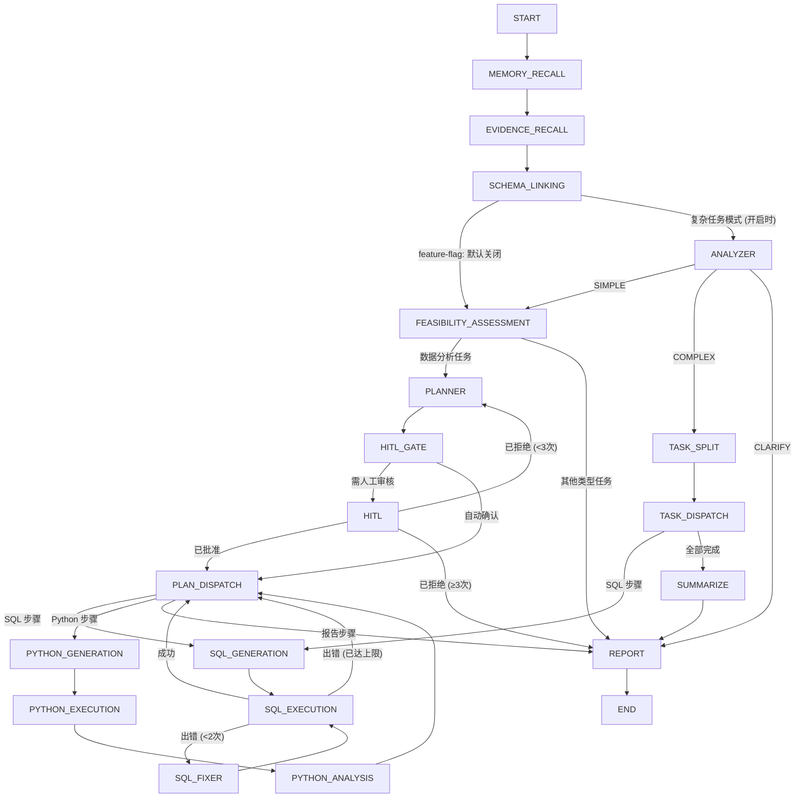

# 📊 Must Be The SQL (更新中...)

<p align="center">
  
  
  
  
  
  
  
  
</p>

<p align="center">
  <b>NL2SQL 智能 Agent 服务端 — StateGraph 多步推理引擎 + LLM 高可用 + MCP 工具生态 + 多租户工作区</b>
</p>

<p align="center">
  <a href="./README.md">🇺🇸 English</a> |
  <a href="#快速开始">⚡ 快速开始</a> |
  <a href="https://github.com/shixia9/MustBeTheSQL">客户端</a>
</p>

---

## 📖 项目简介

**SQL Logic Engine 后端** 是一个基于 Spring Boot 3.2 构建的企业级 AI Agent 平台。它将传统 SQL 工作台与 **StateGraph 驱动的 AI Agent 引擎**（基于 `graph-core`，LangGraph 的 Java 移植）深度结合。用户用自然语言描述数据需求，Agent 自主检索知识、探索数据库结构、规划多步执行、生成并修正 SQL（或 Python 脚本），最终呈现综合报告——**全程可在关键决策点加入人工审核**。

### 核心能力矩阵

| 能力域 | 特性 |
|--------|------|
| **多租户工作区** | 用户 → 工作区两级隔离，OWNER/ADMIN/MEMBER/VIEWER 四级角色权限 |
| **Agent 引擎** | 18 节点 StateGraph，支持简单查询 / 复杂多步分析双模式，含人工审核 (HITL) |
| **LLM 高可用** | 4 种负载均衡策略 + 熔断器 + 降级回退链 + 会话亲和性 + 指标监控 |
| **长期记忆** | SHA256 去重 + pgvector 向量检索 + 自动提取/注入 + 加权排序 |
| **会话上下文** | 多轮追问 + 滑动窗口 + LLM 摘要策略 (SUMMARIZE) |
| **Agent Studio** | 可自定义 Agent（系统提示词/工具开关/RAG 参数/记忆/上下文策略） |
| **RAG 知识库** | pgvector 双通道检索（业务术语表 + Few-Shot 问答对） |
| **Python 沙箱** | Docker 隔离执行 Python 分析脚本 |
| **工具生态** | BUILTIN 工具 + MCP 协议 (SSE/Stdio) 外部工具集成 |
| **管理后台** | 独立 Admin 模块（用户管理/LLM 监控/配额调整） |
| **安全执行** | 5 级 SQL 安全校验链 + 审计日志 + 限流 |
| **可观测性** | 执行链路追踪 (Trace) + 每步 Token/延迟 + 实时 SSE 流式推送 |
| **SSO** | GitHub OAuth 登录 |

---

## 🧠 SQL Agent — StateGraph 架构

Agent 引擎是一个由 **18 个节点** 构成的**有向图**，通过条件边连接，由 `SqlAgentRunner` 驱动执行，并借助 `MemorySaver` 实现基于检查点的暂停/恢复。



### Agent 节点流水线

| 节点 | 角色 | 说明 |
|------|------|------|
| **MEMORY_RECALL** 🧠 | 记忆检索 | 从 pgvector 检索用户 Top-5 长期记忆，注入后续 prompt |
| **EVIDENCE_RECALL** 🔍 | 知识检索 | 将用户问题改写为独立查询语句；通过 pgvector **双通道 RAG**（术语表 + Few-Shot QA 对）检索业务知识 |
| **SCHEMA_LINKING** 🔗 | Schema 上下文构建 | 通过外键关系扩展表集合；构建 DDL + 外键表达式 + 数据样本；使用 LLM 混合选择器过滤相关表 |
| **ANALYZER** 🔬 | 复杂度判定 | LLM 判定任务复杂度（SIMPLE/COMPLEX/CLARIFY），COMPLEX 走任务拆解分支 |
| **FEASIBILITY_ASSESSMENT** ✅ | 任务分类 | 判断请求是"数据分析"类任务（需多步执行）还是简单问答/闲聊 |
| **PLANNER** 📋 | 多步计划生成 | 基于 Schema + 知识召回，生成结构化 JSON 执行计划 |
| **TASK_SPLIT** ✂️ | 任务拆解 | 将复杂分析拆解为多个子任务，持久化到 agent_subtask 表 |
| **HITL_GATE** 🚦 | 审核门控 | LLM 驱动的门控节点，判断计划是否需要人类审核；**自动确认模式** 可跳过此节点 |
| **HITL** 👤 | 人工介入 | 通过 `interruptBefore` 暂停图形执行；等待前端提交批准/拒绝 + 可选反馈意见 |
| **PLAN_DISPATCH** 🧭 | 步骤路由 | 根据计划的当前步骤路由到对应的执行工具节点 |
| **TASK_DISPATCH** 📤 | 子任务调度 | 按 CURRENT_SUBTASK 指针顺序分配子任务 |
| **SQL_GENERATION** → **SQL_EXECUTION** → **SQL_FIXER** | SQL 工具链 | 生成 SQL → 在已连接的数据库上执行 → 出错时自动修复（最多重试 2 次） |
| **PYTHON_GENERATION** → **PYTHON_EXECUTION** → **PYTHON_ANALYSIS** | Python 沙箱链 | 生成 Python 脚本 → 在 Docker 隔离沙箱中执行 → 生成分析结论 |
| **SUMMARIZE** 📝 | 结果汇总 | LLM 汇总所有子任务结果，输出综合结论 |
| **REPORT** ◉ | 报告生成 | 将所有执行结果 + 分析结论 + 记忆偏好汇总为最终的 Markdown 综合报告 |

### 核心特性

- **实时流式推送**：每个节点的结果通过 SSE（Server-Sent Events）实时推送到前端
- **人工介入（HITL）**：计划在 HITL 节点暂停，展示带完整计划上下文的审批卡片。用户可批准、拒绝（→ 重新规划）或提供修改反馈
- **SQL 自动修复**：SQL 执行失败时，修复节点自动分析错误并重试（最多 2 次）
- **Python 沙箱**：数据分析任务在 Docker 容器中执行 Python 脚本，结果纳入报告
- **多轮追问**：对话上下文自动累积，支持"按城市拆一下上面的结果"等连续分析
- **Agent 自定义**：通过 Agent Studio 自由配置系统提示词、工具开关、RAG 参数和记忆策略
- **RAG 知识库**：业务术语表和 Few-Shot 问答对存储在 pgvector 中，按查询实时检索
- **多方言支持**：根据连接配置自动识别 MySQL / PostgreSQL 方言

### MCP 工具

MCP 外部工具在工具抽象层运作：

- `ToolRegistry` 统一管理 BUILTIN + MCP 工具注册表
- `AgentToolGate` 在节点入口处一行调用判断开启/关闭
- MCP 服务器的连接/断开/工具发现由 `McpServerManager` 管理，对 StateGraph 透明

> 一组已有的 18 个节点可以驱动**任意数量**的工具——无论是内置的还是通过 MCP 接入的外部工具。

---

## 🏗️ 模块结构

```
sql-logic-engine-be/
├── sql-logic-common/          # 共享 DTO、异常、工具类、Dubbo 接口
│   ├── dto/                   #  请求/响应 DTO
│   ├── dubbo/                 #  Admin RPC 接口定义
│   ├── exception/             #  BizException, Result 封装
│   └── util/                  #  PasswordUtil, UrlValidationUtil
├── sql-logic-service/         # 核心业务逻辑 + Agent 引擎
│   ├── application/           #  高层应用服务
│   │   └── service/           #   SQL 执行、生成、向量检索、Agent CRUD、管理员
│   ├── domain/
│   │   ├── agent/             #    SQL Agent 引擎
│   │   │   ├── core/          #    SqlAgentRunner, AiAgentManager, HitlSessionRegistry
│   │   │   ├── config/        #    AgentRuntimeConfig, Graph 拓扑配置
│   │   │   ├── node/          #    18 个 StateGraph 节点
│   │   │   ├── edge/          #    条件路由边
│   │   │   ├── ha/            #    LLM 高可用模块
│   │   │   │   ├── circuit/   #    熔断器
│   │   │   │   └── strategy/  #    负载均衡策略（4 种）
│   │   │   ├── tool/          #    工具抽象层 + MCP 集成
│   │   │   │   └── mcp/       #    MCP SSE/Stdio Transport
│   │   │   ├── prompt/        #    LLM 提示词模板管理（18 个 .st 文件）
│   │   │   ├── strategy/      #    LLM 供应商策略模式
│   │   │   └── python/        #    Python 沙箱执行器
│   │   ├── conversation/      #  对话历史 + 上下文窗口管理
│   │   ├── database/          #  数据库连接实体
│   │   ├── memory/            #  长期记忆（去重/检索/提取）
│   │   ├── trace/             #  执行链路追踪
│   │   ├── oauth/             #  GitHub OAuth 集成
│   │   └── workspace/         #  多租户工作区 + 权限断言
│   ├── infrastructure/        #  DAO、AOP、注解、拦截器、健康检查、限流
│   └── trigger/http/          #  REST 控制器
│       └── admin/             #  管理后台控制器
├── sql-logic-admin/           # 管理后台独立模块（Spring Boot + Dubbo）
│   ├── controller/            #  Admin REST API
│   ├── service/               #  管理员业务逻辑
│   └── interceptor/           #  AdminGuard 拦截器
└── sql-logic-gateway/         # API 网关（Spring Cloud Gateway + Nacos + Sa-Token）
```

---

## ✨ 平台功能详情

### 🔌 数据库连接管理
- **多租户** 连接管理，基于 HikariCP 实现连接隔离，支持 workspace 级绑定
- 支持 **MySQL** 和 **PostgreSQL**
- SPI 风格的**方言抽象**，易于扩展新的数据库类型
- **连接验证链**：访问控制、安全检查、令牌配额校验

### 🛡️ SQL 执行安全
- SQL 执行前经过**多层校验链**：
  - SQL 安全检查器（阻止无条件的 DELETE/UPDATE 等破坏性操作）
  - 控制台 SQL 安全检查器
  - 用户状态验证（禁用用户阻止执行）
  - 令牌配额验证（频率限制）
- 通过 AOP `@RecordSqlAudit` 实现 **SQL 审计日志**
- 基于 **JSQLParser** 的 SQL 解析与分类
- 可选 **限流保护**：每用户每分钟 30 请求（RateLimitFilter，默认关闭）

### 👥 多租户工作区
- 用户 → **工作区（Workspace）** 两级资源隔离
- **四级角色权限**：OWNER / ADMIN / MEMBER / VIEWER
- 工作区级资源归属：数据库连接、会话、知识库、Agent 执行记录
- 向后兼容：不传 `workspaceId` 回退到用户级隔离

### 🧠 记忆系统
- **四种记忆类型**：PROFILE（偏好）、TASK（任务模式）、FACT（业务知识）、EPISODIC（会话上下文）
- **自动提取**：每次 Agent 执行完成后异步从对话转录中提取
- **智能注入**：下轮对话自动检索 Top-5 相关记忆注入 prompt
- **SHA256 去重** + 合并策略（importance 取最大、tags 取并集）
- **三入口触发**：执行完成自动 / HITL 肯定 / 前端手动

### 🎛️ Agent Studio
- **Agent 自定义**：系统提示词、欢迎消息、工具开关（sql/schema/python/sample）
- **RAG 配置**：Top-K、Score 阈值、上下文策略（TRUNCATE/SUMMARIZE）
- **记忆开关**：按 Agent 粒度启用/禁用记忆注入
- **版本管理**：手动发布快照、保留 7 天、一键回滚
- **工作区共享**：工作区级 Agent 可见性，团队成员可复用

### ⚡ LLM 高可用
- **4 种负载均衡策略**：轮询 / 延迟优先 / 成功率优先 / 智能加权评分
- **熔断保护**：连续 5 次失败触发熔断，30s 冷却后半开试探
- **降级回退链**：用户可配置备选 Provider 列表，按序降级
- **运行时降级**：单请求内 primary 失败立即切 fallback，秒级响应
- **指标监控**：按分钟窗聚合调用量/成功率/延迟/Token 消耗
- **会话亲和性**：同 session 绑定同一实例，减少上下文切换

### 🔧 MCP 工具生态

系统内置 4 个 BUILTIN 工具（sql / schema / python / sample），并通过 **MCP 协议（Model Context Protocol）** 支持接入外部工具服务器，实现工具生态的可插拔扩展。

#### 工具抽象层

```
ToolDefinition (record)
  ├── name: String              -- 工具唯一标识（"sql", "schema", "python", "sample" 或 MCP 注册名）
  ├── displayName: String       -- 人类可读标签
  ├── description: String       -- 功能描述
  ├── type: ToolType            -- BUILTIN / MCP_SSE / MCP_STDIO / DOCKER_PYTHON
  └── parametersSchema: String  -- JSON Schema（MCP 工具参数定义）

ToolRegistry (@Component)
  └── 启动时注册 4 个 BUILTIN 工具
  └── 运行时动态 register/unregister MCP 工具
```

#### MCP 传输层

支持两种标准 MCP 传输协议：

| Transport | 通信方式 | 适用场景 |
|-----------|---------|---------|
| **MCP SSE** | HTTP POST JSON-RPC | 远程 MCP 服务器（如第三方工具服务） |
| **MCP Stdio** | 子进程 stdin/stdout JSON-RPC | 本地 MCP 服务器（如命令行工具） |

#### 工具注册流程

```
用户添加 MCP 服务器
  → McpServerManager.addServer()
    → 创建 mcp_server_config 记录
    → 连接 MCP 服务器（SSE/Stdio）
    → 调用 tools/list 发现工具
    → 注册到 ToolRegistry（带命名空间前缀防冲突）
    → Agent Studio 可看到新工具并启用/禁用
```

#### AgentToolGate 工具开关

Agent Studio 的工具开关通过 `AgentToolGate.isToolEnabled(state, toolKey)` 控制运行时行为：

| toolKey | 关闭时行为 |
|---------|-----------|
| `schema` | SchemaLinkingNode 跳过外键提取 + 数据采样 |
| `sample` | 跳过 ColumnSampleService 采样调用 |
| `sql` | SqlExecutionNode 输出跳过提示，不执行 SQL |
| `python` | PlannerNode 注入约束 + PlanDispatchNode 安全网拦截 |

MCP 注册的外部工具通过同一机制控制开关，无需修改节点代码。

### 📊 可观测性
- **执行链路追踪**：每个 Agent 请求生成 TraceContext，记录每步 Token/延迟/输出
- **前端可视化**：时序瀑布图 + Token 统计 + 逐节点耗时
- **健康检查**：`/actuator/health` 覆盖 LLM/DB/Redis 状态
- **管理后台**：LLM 调用监控面板 + 用户管理 + 使用统计

### 🔐 鉴权与授权
- **Sa-Token** 会话管理（Redis 持久化）
- BCrypt 兼容的密码哈希
- **GitHub OAuth** SSO 登录
- Admin 管理后台独立认证（SUPER_ADMIN / ADMIN 两级）

---

## 🚀 快速开始

### 前置条件

- JDK 21
- Maven 3.8+
- MySQL 8.0+
- PostgreSQL 14+（pgvector 扩展，用于 RAG 和记忆系统）
- Redis（会话管理）
- Nacos（配置中心/服务发现）
- Docker（Python 沙箱，可选）

### 1. 克隆仓库

```bash
git clone https://github.com/shixia9/MustBeTheSQL-Server.git
cd MustBeTheSQL-Server
```

### 2. 配置

复制 `application-local.yml.example` 为 `application-local.yml`，填入数据库连接信息、LLM API 密钥和 Nacos 地址。

```bash
cp sql-logic-service/src/main/resources/application-local.yml.example \
   sql-logic-service/src/main/resources/application-local.yml
```

### 3. 数据库初始化

核心表包括：
- 用户与认证：`user_info`、`admin_user`
- 多租户：`workspace`、`workspace_member`
- Agent：`agent_entity`、`agent_version`
- LLM：`user_llm_config`、`llm_call_metrics`
- 会话：`conversation`、`conversation_detail`、`agent_execution`、`agent_execution_step`
- 记忆：`memory_item`
- 工具：`mcp_server_config`
- 子任务：`agent_subtask`

### 4. 启动服务

```bash
# 构建项目
mvn clean install -DskipTests

# 启动 Nacos、MySQL、Redis、PostgreSQL

# 启动网关
mvn spring-boot:run -pl sql-logic-gateway

# 启动核心服务
mvn spring-boot:run -pl sql-logic-service

# (可选) 启动管理后台
mvn spring-boot:run -pl sql-logic-admin
```

### 5. Docker Compose 启动

```bash
docker-compose -f docker-compose-local.yml up -d
```

---

## 🔧 配置说明

主要配置文件位于 `sql-logic-service/src/main/resources/`：

| 文件 | 用途 |
|------|------|
| `application.yml` | 基础配置（数据源、MyBatis、LLM 供应商） |
| `application-local.yml` | 本地覆盖配置（凭据、API 密钥） |
| `bootstrap.yml` | Nacos 引导配置 |
| `prompts/*.st` | **LLM 提示词模板**（18 个模板，覆盖所有 Agent 节点及记忆/摘要功能） |

### Feature Flags

| 配置项 | 默认值 | 说明 |
|--------|--------|------|
| `phase-b.task-split.enabled` | `false` | 启用 ANALYZER → TASK_SPLIT 复杂任务拆解分支 |
| `agent.rate-limit.enabled` | `false` | 启用 Agent 端点限流（30 req/min/用户） |
| `oauth.github.client-id` | — | 配置 GitHub OAuth SSO（配置后前端自动显示按钮） |

---

## 📡 API 端点

### Agent 与 SQL

| 端点 | 方法 | 用途 |
|------|------|------|
| `/api/v1/agent/sql/stream` | POST | 启动 Agent 运行（SSE 流式推送） |
| `/api/v1/agent/sql/continue` | POST | 恢复暂停的 HITL 会话（SSE） |
| `/api/v1/sql/execute` | POST | 在已连接数据库上执行 SQL |
| `/api/v1/sql/console/execute` | POST | SQL 控制台执行 |

### 工作区

| 端点 | 方法 | 用途 |
|------|------|------|
| `/api/v1/workspaces` | GET / POST | 列表 / 创建工作区 |
| `/api/v1/workspaces/{id}` | PUT / DELETE | 更新 / 删除工作区 |
| `/api/v1/workspaces/{id}/members` | GET / POST | 成员列表 / 邀请成员 |
| `/api/v1/workspaces/{id}/members/{userId}` | PUT / DELETE | 改角色 / 移除成员 |

### Agent Studio

| 端点 | 方法 | 用途 |
|------|------|------|
| `/api/v1/agent-entity/list` | GET | Agent 列表（含工作区共享） |
| `/api/v1/agent-entity` | POST | 创建 Agent |
| `/api/v1/agent-entity/{id}` | GET / PUT / DELETE | 查看 / 编辑 / 删除 Agent |
| `/api/v1/agent-entity/{id}/default` | PUT | 设为默认 Agent |
| `/api/v1/agent-entity/{id}/publish` | POST | 发布版本快照 |
| `/api/v1/agent-entity/{id}/versions` | GET | 版本历史 |
| `/api/v1/agent-entity/{id}/versions/{vid}/revert` | POST | 回滚到指定版本 |

### LLM 配置与高可用

| 端点 | 方法 | 用途 |
|------|------|------|
| `/api/v1/llm-config` | GET / POST | 列表 / 添加 LLM 配置 |
| `/api/v1/llm-config/{id}` | PUT / DELETE | 更新 / 删除配置 |
| `/api/v1/llm-config/{id}/test` | POST | 测试 LLM 连通性 |
| `/api/v1/llm-config/{id}/strategy` | PUT | 更新 HA 策略 + 降级链 |
| `/api/v1/llm-config/{id}/metrics` | GET | 查看 LLM 指标 |

### 记忆

| 端点 | 方法 | 用途 |
|------|------|------|
| `/api/v1/memory/list` | GET | 记忆列表（按类型筛选） |
| `/api/v1/memory` | POST | 手动创建记忆 |
| `/api/v1/memory/{id}` | DELETE | 删除记忆 |
| `/api/v1/memory/extract` | POST | 手动触发记忆提取 |

### 会话

| 端点 | 方法 | 用途 |
|------|------|------|
| `/api/v1/conversations/user/{userId}/summaries` | GET | 会话摘要列表（分页） |

### MCP 工具

| 端点 | 方法 | 用途 |
|------|------|------|
| `/api/v1/tools` | GET | 已注册工具列表 |
| `/api/v1/mcp-servers` | GET / POST | 列表 / 添加 MCP 服务器 |
| `/api/v1/mcp-servers/{id}` | DELETE | 删除 MCP 服务器 |
| `/api/v1/mcp-servers/{id}/connect` | POST | 重新连接 |
| `/api/v1/mcp-servers/{id}/disconnect` | POST | 断开连接 |
| `/api/v1/mcp-servers/{id}/status` | GET | 连接状态 |

### 其他

| 端点 | 方法 | 用途 |
|------|------|------|
| `/api/v1/database/**` | 多方法 | 数据库连接 CRUD + 元数据 |
| `/api/v1/schema/**` | 多方法 | Schema 浏览（表/列/索引/DDL） |
| `/api/v1/user/**` | 多方法 | 用户注册、登录、个人信息 |
| `/api/v1/user/admin-check` | GET | 检查当前用户是否为管理员 |
| `/api/v1/business-knowledge/**` | 多方法 | 业务术语表 + 知识库 CRUD |
| `/api/v1/oauth/github/status` | GET | 检查 GitHub OAuth 是否已配置 |
| `/api/v1/oauth/github/authorize` | GET | 跳转 GitHub 授权 |
| `/api/v1/admin/**` | 多方法 | 管理后台 API（需 ADMIN 角色） |
| `/actuator/health` | GET | 健康检查 |

---

## 🧪 项目阶段

### 已完成

- ✅ **Phase 1**：单次 LLM 调用的 NL2SQL
- ✅ **Phase 2**：Schema Linking — 外键扩展 + LLM 表过滤 + 数据采样
- ✅ **Phase 3**：可行性评估 + 计划器 + 计划调度，含 SQL/Python 工具循环
- ✅ **Phase 4**：人工介入（HITL）— 基于 StateGraph 检查点的中断/恢复
- ✅ **Phase 5**：RAG 知识库 — pgvector 双通道检索（术语表 + Few-Shot 问答）
- ✅ **Phase A**：多租户工作区 + 执行追踪系统 + LLM Provider 管理 UI + 消息类型区分
- ✅ **Phase B**：LLM 高可用（4 策略 + 熔断 + 降级）+ Agent 状态机升级 + 记忆系统 + Agent Studio + 会话上下文
- ✅ **Phase C**：工具开关闭环 + 上下文摘要策略 + 会话持久化检索 + 管理后台 + 限流/健康检查
- ✅ **Phase D**：MCP 工具生态（工具抽象层 + SSE/Stdio Transport）+ Agent 版本管理 + 工作区共享 + GitHub OAuth SSO
- 🚧 **Phase E**：前端闭环 — MCP 管理页面 + Agent 版本 UI + 工具动态加载 + 工作区归属可视化
