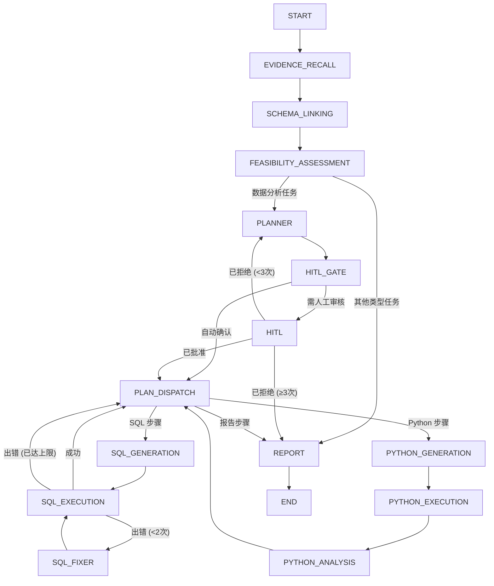

# 📊 Must Be The SQL （更新中）

<p align="center">
  
  
  
  
  
  
  
  
</p>

<p align="center">
  <b>🧠 AI 驱动的 SQL 智能 Agent 后端 — 基于 StateGraph 的多步推理引擎，支持人工介入审核</b>
</p>

<p align="center">
  <a href="./README.md">🇺🇸 English</a> |
  <a href="#快速开始">⚡ 快速开始</a> |
  <a href="https://github.com/shixia9/MustBeTheSQL">客户端</a>
</p>

---

## 📖 项目简介

**SQL Logic Engine 后端** 是一个基于 Spring Boot 3.2 构建的服务，它将传统 SQL 工作台与 **StateGraph 驱动的 AI Agent 引擎**（基于 `graph-core`，LangGraph 的 Java 移植）相结合。用户用自然语言描述数据需求，Agent 自主检索知识、探索数据库结构、规划多步执行、生成并修正 SQL（或 Python 脚本），最终呈现综合报告——**全程可在关键决策点加入人工审核**。

---

## 🧠 SQL Agent — StateGraph 架构

Agent 引擎是一个由 **14 个节点** 构成的**有向图**，通过条件边连接，由 `SqlAgentRunner` 驱动执行，并借助 `MemorySaver` 实现基于检查点的暂停/恢复。



### Agent 节点流水线

| 节点 | 角色 | 说明 |
|------|------|------|
| **EVIDENCE_RECALL** 🔍 | 知识检索 | 将用户问题改写为独立查询语句；通过 pgvector **双通道 RAG**（术语表 + Few-Shot QA 对）检索业务知识 |
| **SCHEMA_LINKING** 🔗 | Schema 上下文构建 | 通过外键关系扩展表集合；构建 DDL + 外键表达式 + 数据样本；使用 LLM **混合选择器** 过滤相关表 |
| **FEASIBILITY_ASSESSMENT** ✅ | 任务分类 | 判断请求是"数据分析"类任务（需多步执行）还是简单问答/闲聊 |
| **PLANNER** 📋 | 多步计划生成 | 基于 Schema + 知识召回，生成结构化 JSON 执行计划（SQL 生成、Python 分析、报告） |
| **HITL_GATE** 🚦 | 审核门控 | LLM 驱动的门控节点，判断计划是否需要人类审核；**自动确认模式** 可跳过此节点 |
| **HITL** 👤 | 人工介入 | 通过 `interruptBefore` 暂停图形执行；等待前端提交批准/拒绝 + 可选反馈意见 |
| **PLAN_DISPATCH** 🧭 | 步骤路由 | 根据计划的当前步骤路由到对应的执行工具节点 |
| **SQL_GENERATION** → **SQL_EXECUTION** → **SQL_FIXER** | SQL 工具链 | 生成 SQL → 在已连接的数据库上执行 → 出错时自动修复（最多重试 2 次） |
| **PYTHON_GENERATION** → **PYTHON_EXECUTION** → **PYTHON_ANALYSIS** | Python 沙箱链 | 生成 Python 脚本 → 在隔离沙箱中执行 → 生成分析结论 |
| **REPORT** ◉ | 报告生成 | 将所有执行结果 + 分析结论汇总为最终的 Markdown 综合报告 |

### 核心特性

- **实时流式推送**：每个节点的结果通过 SSE（Server-Sent Events）实时推送到前端
- **人工介入（HITL）**：计划在 HITL 节点暂停，展示带完整计划上下文的审批卡片。用户可批准、拒绝（→ 重新规划）或提供修改反馈
- **SQL 自动修复**：SQL 执行失败时，修复节点自动分析错误并重试（最多 2 次）
- **Python 沙箱**：数据分析任务在 `SimplePythonExecutor` 沙箱中执行 Python 脚本，结果纳入报告
- **RAG 知识库**：业务术语表和 Few-Shot 问答对存储在 pgvector 中，按查询实时检索
- **多方言支持**：根据连接配置自动识别 MySQL / PostgreSQL 方言

---

## 🏗️ 模块结构

```
sql-logic-engine-be/
├── sql-logic-common/          # 共享 DTO、异常、工具类
│   ├── dto/                   #  请求/响应 DTO
│   ├── exception/             #  BizException, Result 封装
│   └── util/                  #  PasswordUtil, UrlValidationUtil
├── sql-logic-service/         # 核心业务逻辑 + Agent 引擎
│   ├── application/           #  高层应用服务
│   │   └── service/           #   SQL 执行、生成、向量检索等
│   ├── domain/
│   │   ├── agent/             #    SQL Agent 引擎
│   │   │   ├── core/          #    SqlAgentRunner, AiAgentManager, HitlSessionRegistry
│   │   │   ├── node/          #    14 个 StateGraph 节点
│   │   │   ├── edge/          #    条件路由边
│   │   │   ├── dto/           #    Agent 专用 DTO
│   │   │   ├── prompt/        #    LLM 提示词模板管理（.st 文件）
│   │   │   ├── strategy/      #    LLM 供应商策略模式
│   │   │   └── python/        #    Python 沙箱执行器
│   │   ├── conversation/      #  对话历史聚合
│   │   └── database/          #  数据库连接实体
│   ├── infrastructure/        #  DAO、AOP、注解
│   └── trigger/http/          #  REST 控制器
└── sql-logic-gateway/         # API 网关（Spring Cloud Gateway + Nacos）
```

---

## ✨ 平台功能

除 Agent 引擎外，后端还提供丰富的数据库平台功能：

### 🔌 数据库连接管理
- **多租户** 连接管理，基于 HikariCP 实现连接隔离
- 支持 **MySQL** 和 **PostgreSQL**
- SPI 风格的**方言抽象**，易于扩展新的数据库类型
- **连接验证链**：访问控制、安全检查、令牌配额校验

### 🛡️ SQL 执行安全
- SQL 执行前经过**多层校验链**：
  - SQL 安全检查器（阻止无条件的 DELETE/UPDATE 等破坏性操作）
  - 控制台 SQL 安全检查器
  - 用户状态验证（禁用用户阻止执行）
  - 令牌配额验证（频率限制）
- 通过 AOP `@RecordSqlAudit` 实现 **SQL 审计日志**
- 基于 **JSQLParser** 的 SQL 解析与分类

### 📊 Schema 发现
- 完整的数据库元数据自省（Schema、表、列、索引、主键）
- DDL 自动生成（`CREATE TABLE` / `VIEW`）
- 为 Schema Linking 提供**外键关系提取**
- 为 LLM 上下文提供**列数据采样**

### 🔐 鉴权与授权
- **Sa-Token** 会话管理
- BCrypt 兼容的密码哈希

---

## 🚀 快速开始

### 前置条件

- JDK 21
- Maven 3.8+
- MySQL / PostgreSQL
- Nacos（配置中心）
- pgvector（可选，用于 RAG 功能）

### 1. 克隆仓库

```bash
git clone https://github.com/shixia9/MustBeTheSQL-Server.git
cd MustBeTheSQL-Server
```

### 2. 配置数据库

复制 `application-local.yml.example` 为 `application-local.yml`，填入数据库连接信息、LLM API 密钥和 Nacos 地址。

### 3. 启动服务

```bash
# 构建项目
mvn clean install -DskipTests

# 启动服务模块（含内嵌 Tomcat）
mvn spring-boot:run -pl sql-logic-service
```

### 4.（可选）通过网关启动

```bash
# 先启动 Nacos，然后：
mvn spring-boot:run -pl sql-logic-gateway
mvn spring-boot:run -pl sql-logic-service
```

### 5. 使用 Docker Compose 启动

```bash
docker-compose -f docker-compose-local.yml up -d
```

---

## 🔧 配置说明

主要配置文件位于 `sql-logic-service/src/main/resources/`：

| 文件 | 用途 |
|------|------|
| `application.yml` | 基础配置（数据源、MyBatis、LLM 供应商） |
| `application-local.yml` | 本地覆盖配置（凭据、API 密钥） |
| `bootstrap.yml` | Nacos 引导配置 |
| `prompts/*.st` | **LLM 提示词模板**（14 个模板，对应所有 Agent 节点） |

---

## 📡 API 端点

| 端点 | 方法 | 用途 |
|------|------|------|
| `/api/v1/agent/sql/stream` | POST | 启动 Agent 运行（SSE 流式推送） |
| `/api/v1/agent/sql/continue` | POST | 恢复暂停的 HITL 会话（SSE） |
| `/api/v1/sql/generate` | POST | 直接 SQL 生成（非 Agent 路径） |
| `/api/v1/sql/execute` | POST | 在已连接数据库上执行 SQL |
| `/api/v1/sql/console/execute` | POST | SQL 控制台执行 |
| `/api/v1/database/**` | 多方法 | 数据库连接 CRUD + 元数据 |
| `/api/v1/workspace/**` | 多方法 | 工作区管理 |
| `/api/v1/conversation/**` | 多方法 | 对话历史 CRUD |
| `/api/v1/user/**` | 多方法 | 用户注册、登录、个人信息 |
| `/api/v1/llm-config/**` | 多方法 | LLM 配置管理 |
| `/api/v1/business-knowledge/**` | 多方法 | 业务术语表 + 知识库 CRUD |

---

## 🧪 项目阶段

- ✅ **Phase 1**：单次 LLM 调用的 NL2SQL
- ✅ **Phase 2**：Schema Linking — 外键扩展 + LLM 表过滤 + 数据采样
- ✅ **Phase 3**：可行性评估 + 计划器 + 计划调度，含 SQL/Python 工具循环
- ✅ **Phase 4**：人工介入（HITL）— 基于 StateGraph 检查点的中断/恢复
- ✅ **Phase 5**：RAG 知识库 — pgvector 双通道检索（术语表 + Few-Shot 问答）
- 🚧 **规划中**：语义模型集成、多轮会话记忆、高级 Python 分析
