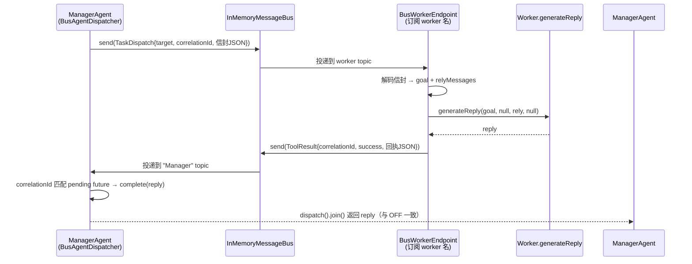

# REQ-02 实施结果报告

> 需求：[REQ-02 · 消息总线与 AgentOrchestrator 集成（M9，拆 a/b）](../requirements/REQ-02-message-bus-orchestrator-integration.md)
>
> 来源计划：[11-production-grade-iteration-plan.md](../11-production-grade-iteration-plan.md)（M9）
>
> 实施日期：2026-08-06
>
> 代码库：`MustBeTheSQL-Server/sql-logic-service`
>
> 验证状态：**编译通过 + 20/20 新增测试通过 + 36/36 既有回归通过 + 全 agentic 域 256/259 通过（3 个预存 ChartActionTest 失败与本需求无关）**

---

## 1. 整体结果概述

### 1.1 实施目标回顾

REQ-02 是 v2.0「生产级 Multi-Agent」迭代的 **P0 关键路径最高风险项**：将 [AgentOrchestrator](../../MustBeTheSQL-Server/sql-logic-service/src/main/java/com/sql/logic/engine/domain/agentic/config/AgentOrchestrator.java) 的 6-Agent 系统通信从「ManagerAgent 直接调用 `speaker.generateReply()` + 共享 `OverAllState`」改造为「经 REQ-01 的 `InMemoryMessageBus` 收发 `BusMessage`」，且**零行为回归**。

需求明确采用**先旁路后切换**两阶段策略（M9a 旁路 + M9b 切换），并以「M9a 旁路验证通过」作为 P0 里程碑判定线（AC-6），M9b 切换可推迟。

### 1.2 实施成果

| 维度 | 结果 |
|------|------|
| 新增生产代码文件 | 9 个（`domain/agentic/core/bus/` 下 9 个类，共 +791 行） |
| 修改生产代码文件 | 2 个（`ManagerAgent.java`、`AgenticAutoConfiguration.java`） |
| 新增测试文件 | 7 个（6 个测试类 + 1 个测试桩，共 +667 行） |
| 新增测试用例 | 20 个，全部通过 |
| 既有回归 | 36/36 通过（ManagerAgentTest 7 + AgentMessageTest 12 + BusMessageTest 6 + InMemoryMessageBusTest 11） |
| 全 agentic 域回归 | 256/259 通过；3 个 `ChartActionTest` 失败为**预存遗留**（SQL 图表生成，使用 StubSqlExecutionService，与本需求无关，已在项目记忆中登记） |
| 既有调用点破坏 | **0**（ManagerAgent 的 6 处 `generateReply` 直调全部经新增 `dispatchToWorker` 单一 chokepoint 收口；`dispatcher=null` 时自动回退原直调，旧测试零修改通过） |
| 默认行为变更 | **无**（`bus-orc.mode` 默认 `OFF`，生产路径与改造前比特一致） |

### 1.3 关键设计决策

1. **现状再认知**：经源码核查，6-Agent 通信并非计划书设想的「纯共享 state 读写」——`ManagerAgent.act()` 内部通过 `speaker.generateReply(goalMessage, this, ...).join()` **直接方法调用**编排 worker，`OverAllState.NEXT_NODE` 仅用于 StateGraph 条件边路由（`MANAGER → {workers} → END`）。因此「切换」的本质是：用总线传输替代这 6 处直接调用，`NEXT_NODE` 保留于 state（满足 AC-5）。

2. **单一 chokepoint 收口**：在 `ManagerAgent` 引入私有 `dispatchToWorker(worker, goal, rely)` 方法，6 处 `generateReply` 直调全部改走它。`dispatcher` 为 null 时回退原直调——既保证生产 wiring（Spring 注入 dispatcher）走总线抽象，又让既有 `ManagerAgentTest`（不设 dispatcher）零修改通过。

3. **三态配置开关 + 失败回退**：引入 `bus-orc.mode`（`OFF`/`BYPASS`/`SWITCH`），默认 `OFF`。`OFF` = 原直调；`BYPASS` = 直调 + 总线镜像（M9a，可观测可验证）；`SWITCH` = 总线承载业务消息（M9b）。任一时刻关闭开关即回退纯直调（AC-2）。

4. **协议稳定性**：**不修改** REQ-01 的 sealed `BusMessage` 协议（不新增子类型，避免破坏 REQ-01 穷举性测试）。SWITCH 模式将完整的派发信封（goal content + context + rely messages）以 JSON 编码进 `TaskDispatch.task` 自由字符串字段，经 `BusMessageAdapter` 双向编解码，保持 REQ-01 协议零变更。

---

## 2. 具体实现方式与技术方案

### 2.1 架构定位

```
domain/agentic/core/bus/                      ← REQ-01 已交付（协议 + 总线）
├── BusMessage.java                           ← sealed 协议（REQ-01，未改动）
├── AgentMessageBus.java                      ← 总线接口（REQ-01，未改动）
├── InMemoryMessageBus.java                   ← 内存实现（REQ-01，未改动）
│
│   ┄┄┄ REQ-02 新增（编排集成层）┄┄┄
├── BusOrchestrationMode.java                 ← 三态枚举 OFF/BYPASS/SWITCH
├── BusOrchestrationProperties.java           ← @ConfigurationProperties(prefix="bus-orc")
├── BusMessageAdapter.java                    ← AgentMessage ↔ BusMessage 信封编解码
├── AgentDispatcher.java                      ← 派发抽象接口
├── DirectAgentDispatcher.java                ← OFF：直调 generateReply
├── BypassAgentDispatcher.java                ← BYPASS（M9a）：直调 + 总线镜像
├── BusAgentDispatcher.java                   ← SWITCH（M9b）：总线请求/应答
├── BusWorkerEndpoint.java                    ← SWITCH worker 端：订阅并执行
└── BusWorkerEndpointRegistrar.java           ← SWITCH 启动：批量注册 worker 端点
```

### 2.2 派发抽象（AgentDispatcher）—— 三态策略的核心

REQ-02 将「ManagerAgent 如何把一项工作交给 worker 并等回复」抽象为 `AgentDispatcher` 接口：

```java
public interface AgentDispatcher {
    CompletableFuture<AgentMessage> dispatch(Agent sender, Agent target,
                                             AgentMessage goal, List<AgentMessage> relyMessages);
    BusOrchestrationMode mode();
}
```

`ManagerAgent` 不再直接调 `generateReply`，而是调 `dispatchToWorker`（内部委托 `dispatcher.dispatch`）。三种实现由 `bus-orc.mode` 选择：

| 模式 | 实现类 | 执行路径 | 总线角色 |
|------|--------|---------|---------|
| `OFF`（默认） | `DirectAgentDispatcher` | `target.generateReply(...)` 直调 | 不参与 |
| `BYPASS`（M9a） | `BypassAgentDispatcher` | 直调（行为不变）+ 镜像 `TaskDispatch`/`ToolResult` | 可观测镜像 |
| `SWITCH`（M9b） | `BusAgentDispatcher` + `BusWorkerEndpoint` | 总线请求/应答 | 业务消息通道 |

### 2.3 M9a — 旁路并行（BypassAgentDispatcher）

执行与 `OFF` 比特一致（内部复用 `DirectAgentDispatcher` 驱动真实 `generateReply`），在调用前后向总线镜像一对相关联的消息：

```java
// 派发前镜像 TaskDispatch（best-effort）
bus.send(toTaskDispatch(senderName, targetName, correlationId, encodeGoalEnvelope(goal, rely)));
// 真实执行（与 OFF 一致）
return engine.dispatch(sender, target, goal, rely).handle((reply, err) -> {
    // 派发后镜像 ToolResult（best-effort，correlationId 与 TaskDispatch 一致）
    bus.send(toToolResult(targetName, senderName, correlationId, success, encodeReplyEnvelope(reply)));
    return reply;
});
```

- **`correlationId`** 串联同一轮派发的 `TaskDispatch`（前）与 `ToolResult`（后），使通信链路可重放、可断言等价。
- **best-effort**：总线镜像失败仅 `log.warn`，绝不阻断编排热路径（`MessageBusParityTest` 验证毒性 handler 不影响派发）。
- **等价性闸门**：`MessageBusParityTest` 断言「每次派发恰好产生一对 target/success 一致的 `TaskDispatch`→`ToolResult`」——这是 AC-1 的硬验证，不一致即阻塞 M9b 切换（需求 §8 风险控制）。

### 2.4 M9b — 切换（BusAgentDispatcher + BusWorkerEndpoint）

总线成为业务消息的承载通道，同步编排语义通过 `correlationId` 匹配的 `CompletableFuture` 保留：



- **`BusAgentDispatcher`**：构造时订阅 `"Manager"` topic 收 `ToolResult`；`dispatch` 生成 `correlationId`、登记 pending future、`bus.send(TaskDispatch)`；`orTimeout` 兜底（默认 300s，worker 无响应即失败而非挂死）。
- **`BusWorkerEndpoint`**：每个 worker 一个，构造时订阅自身名 topic；收到 `TaskDispatch` 后在独立虚拟线程执行 `worker.generateReply`，再 `bus.send(ToolResult)` 回执，`correlationId` 透传。
- **`NEXT_NODE` 保留**：StateGraph 条件边仍读 `OverAllState.NEXT_NODE` 路由（`AgentOrchestrator` 未改动），仅业务消息走总线（AC-5）。

### 2.5 信封编解码（BusMessageAdapter）—— 协议稳定性关键

`AgentMessage` 是无 `@JsonCreator` 的不可变类，无法直接 Jackson 反序列化。适配器用 **Jackson 友好的中间 record 信封** + `AgentMessage.Builder` 重建，往返于 `TaskDispatch.task` / `ToolResult.result` 自由字符串字段：

```
AgentMessage(+context/rely) ──encode──▶ GoalEnvelope(JSON) ──▶ TaskDispatch.task
TaskDispatch.task ──▶ GoalEnvelope(JSON) ──decode──▶ AgentMessage(+relyMessages)
AgentMessage(+actionReport) ──encode──▶ ReplyEnvelope(JSON) ──▶ ToolResult.result
```

- **上下文安全净化**：`sanitizeContext` 递归保留 `String/Number/Boolean/Map/List/Enum`，其余（如 `TraceContext`、`CompletableFuture`）强转 `toString`——保证编码永不抛异常，一个不可序列化的上下文条目降级为字符串而非中断派发。
- **回执保真**：`ReplyActionOutput` 携带 `success/content/data/hasRetry`，ManagerAgent 读取的 `reply.actionReport()` 完整重建。
- **REQ-01 协议零改动**：未给 sealed `BusMessage` 增加子类型，REQ-01 的穷举性 `switch` 测试无需调整。

### 2.6 Spring 装配（AgenticAutoConfiguration）

新增三个 `@Bean`，并对 `managerAgent` 注入 `AgentDispatcher`：

```java
@Bean public AgentMessageBus agentMessageBus() { return new InMemoryMessageBus(); }

@Bean public AgentDispatcher agentDispatcher(BusOrchestrationProperties props, AgentMessageBus bus) {
    return switch (props.getMode()) {
        case OFF    -> new DirectAgentDispatcher();
        case BYPASS -> new BypassAgentDispatcher(bus, new DirectAgentDispatcher());
        case SWITCH -> new BusAgentDispatcher(bus, "Manager", props.getDispatcherTimeoutSeconds());
    };
}

@Bean @ConditionalOnProperty(name = "bus-orc.mode", havingValue = "switch")
public BusWorkerEndpointRegistrar busWorkerEndpointRegistrar(AgentMessageBus bus,
        PlannerAgent p, DataScientistAgent ds, CodeAssistantAgent ca,
        ToolAssistantAgent ta, DashboardAssistantAgent da) { /* 逐个 register */ }
```

- `BusOrchestrationProperties` 为 `@Component @ConfigurationProperties(prefix="bus-orc")`，默认 `mode=OFF`——**默认下 registrar bean 不创建，dispatcher 为 Direct，生产路径与改造前一致**。
- `registrar` 仅在 `switch` 模式作为 eager 单例创建，启动期即订阅全部 worker，保证首个请求到达前端点已就绪。

### 2.7 ManagerAgent 改造——6 处直调收口

新增 `dispatcher` 字段 + `setDispatcher` + `dispatchToWorker` 私有方法（`dispatcher==null` 回退直调），6 处 `speaker/planner/dashboard.generateReply(..., this, ...).join()` 全部改为 `dispatchToWorker(...).join()`：

| 路径 | 原 6 处直调点 | 改后 |
|------|--------------|------|
| `handleSimplePath` | DataScientist / Dashboard 摘要 | `dispatchToWorker` ×2 |
| `handleToolInvocationPath` | ToolAssistant | `dispatchToWorker` ×1 |
| `handleFullOrchestration` | Planner / worker(带 rely) / Dashboard | `dispatchToWorker` ×3 |

`send(goalMessage, speaker).join()`（`receive` 通知，写记忆）保留不动——它是既有派发前通知，三态均保留以维持行为一致。

---

## 3. 改动文件清单

### 3.1 总览

| # | 文件 | 类型 | 改动性质 | 行数 |
|---|------|------|---------|------|
| 1 | `core/bus/BusOrchestrationMode.java` | 新增 | 简单 | 35 |
| 2 | `core/bus/BusOrchestrationProperties.java` | 新增 | 简单 | 45 |
| 3 | `core/bus/AgentDispatcher.java` | 新增 | 简单 | 40 |
| 4 | `core/bus/DirectAgentDispatcher.java` | 新增 | 简单 | 33 |
| 5 | `core/bus/BusWorkerEndpointRegistrar.java` | 新增 | 简单 | 52 |
| 6 | `core/bus/BusMessageAdapter.java` | 新增 | **核心** | 287 |
| 7 | `core/bus/BypassAgentDispatcher.java` | 新增 | **核心** | 87 |
| 8 | `core/bus/BusAgentDispatcher.java` | 新增 | **核心** | 119 |
| 9 | `core/bus/BusWorkerEndpoint.java` | 新增 | **核心** | 93 |
| 10 | `agent/ManagerAgent.java` | 修改 | **核心** | +约 40（841 总行） |
| 11 | `config/AgenticAutoConfiguration.java` | 修改 | **核心** | +约 75（531 总行） |
| 12 | `test/.../bus/BusMessageAdapterTest.java` | 新增 | 测试 | 126 |
| 13 | `test/.../bus/DirectAgentDispatcherTest.java` | 新增 | 测试 | 39 |
| 14 | `test/.../bus/BypassAgentDispatcherTest.java` | 新增 | 测试 | 104 |
| 15 | `test/.../bus/BusAgentDispatcherTest.java` | 新增 | 测试 | 113 |
| 16 | `test/.../bus/MessageBusParityTest.java` | 新增 | 测试 | 97 |
| 17 | `test/.../bus/ManagerAgentBusIntegrationTest.java` | 新增 | 测试 | 127 |
| 18 | `test/.../bus/StubConversableAgent.java` | 新增 | 测试桩 | 61 |

> 路径前缀：生产 = `MustBeTheSQL-Server/sql-logic-service/src/main/java/com/sql/logic/engine/domain/agentic/`；测试 = `.../src/test/java/com/sql/logic/engine/domain/agentic/`。

---

### 3.2 核心文件详细说明

#### 文件 6：`core/bus/BusMessageAdapter.java`（新增 · 核心）

**修改目的**：在 REQ-01 的 lean `BusMessage` 协议与既有富 `AgentMessage` 信封之间架桥，使 SWITCH 模式能在不改动 sealed 协议的前提下，把完整的派发意图（goal + 上下文 + 依赖消息）与回执（success + actionReport）无损压进 `TaskDispatch.task` / `ToolResult.result` 自由字符串字段。

**功能与代码逻辑**：

1. **三个中间 record 信封**：`GoalEnvelope`（content/currentGoal/sender/rounds/messageType/context/relyMessages）、`ReplyEnvelope`（content/success/rounds/context/actionReport/error）、`ReplyActionOutput`（success/content/data/hasRetry）。均 Jackson 友好，紧凑构造器做 `Map.copyOf`/`List.copyOf` 防御性拷贝。

2. **编码**（`encodeGoalEnvelope`/`encodeReplyEnvelope`/`encodeErrorEnvelope`）：把 `AgentMessage` 拆解为信封 record，`MAPPER.writeValueAsString` 序列化。编码失败降级为 `{"error":"..."}` 字符串而非抛异常——总线永不因编码丢消息。

3. **解码**（`decodeGoalEnvelope`/`decodeReplyEnvelope`）：反序列化信封 record，经 `AgentMessage.Builder` 重建 `AgentMessage`。`DecodedGoal` record 同时返回 goal 与 relyMessages 列表。`messageType` 字符串经 `valueOf` 还原（非法值容错跳过）。

4. **`jsonSafe` 递归净化**：`sanitizeContext` 对上下文 Map 的每个值递归过滤——保留 `String/Number/Boolean/Map/List/Enum`，其余 `toString`。这是健壮性关键：上下文里若混入 `CompletableFuture`/`TraceContext` 等非 JSON 类型，编码不抛异常而是降级为字符串。

5. **BusMessage 工厂**：`toTaskDispatch(sender, target, correlationId, taskEnvelope)` 与 `toToolResult(sender, receiver, correlationId, success, resultEnvelope)`，用 `BusHeader.Builder` 填充身份（自动生成 messageId/timestamp，`correlationId` 串联请求-应答）。

#### 文件 7：`core/bus/BypassAgentDispatcher.java`（新增 · 核心 · M9a）

**修改目的**：实现 M9a 旁路双写——执行与 OFF 比特一致，额外把每次派发镜像成一对相关联的 `TaskDispatch`/`ToolResult` 到总线，使通信链路可观测、可重放、可断言等价（AC-1/AC-2）。

**功能与代码逻辑**：

1. **构造**：持 `AgentMessageBus` + 内嵌 `AgentDispatcher engine`（默认 `DirectAgentDispatcher`），保证执行路径与 OFF 完全相同。

2. **`dispatch`**：生成 `correlationId`；派发前 `bus.send(toTaskDispatch(...))` 镜像出站任务；调 `engine.dispatch(...)` 真实执行；`.handle((reply, err) -> ...)` 在完成后 `bus.send(toToolResult(...))` 镜像回执（`correlationId` 透传，`success` 与真实 reply 一致）。

3. **best-effort 镜像**：两处镜像均 try/catch 包裹，失败仅 `log.warn`。真实错误经 `.handle` 重新抛出（`RuntimeException` 直接抛，受检异常包装），调用方看到的是真实失败而非镜像副作用。

4. **`mode()` 返回 `BYPASS`**。

#### 文件 8：`core/bus/BusAgentDispatcher.java`（新增 · 核心 · M9b）

**修改目的**：实现 M9b 切换——总线成为业务消息通道，ManagerAgent 派发经总线请求/应答，同步编排语义由 `correlationId` 匹配的 `CompletableFuture` 保留。

**功能与代码逻辑**：

1. **构造**：持 `bus` + `managerName` + `timeoutSeconds`；构造时 `bus.subscribe(managerName, this::handleReply)` 订阅自身 topic 收 `ToolResult` 回执。

2. **`dispatch`**：生成 `correlationId`，登记 `pending.put(correlationId, future)`；`bus.send(toTaskDispatch(managerName, target.name(), correlationId, envelope))`；返回 `future.orTimeout(timeoutSeconds, SECONDS)`。

3. **`handleReply`**：收到 `ToolResult` → 取 `correlationId` → `pending.remove` → `decodeReplyEnvelope(tr.result())` 重建 reply → `future.complete(reply)`。已完成/无匹配的忽略。

4. **超时兜底**：`exceptionally` 中移除 pending、记录告警、抛 `RuntimeException`——worker 无响应时编排失败而非永久挂死（`BusAgentDispatcherTest.shouldTimeoutWhenNoWorkerResponds` 验证 ~1s 超时）。

5. **`shutdown`**：取消订阅 + 让所有 pending 失败，供测试 teardown。

#### 文件 9：`core/bus/BusWorkerEndpoint.java`（新增 · 核心 · M9b）

**修改目的**：SWITCH 模式 worker 端——把总线投递的 `TaskDispatch` 桥接成真实 `generateReply` 执行，并回执 `ToolResult`。

**功能与代码逻辑**：

1. **构造**：持 `bus`/`worker`/`managerName` + 独立虚拟线程 `ExecutorService`；`bus.subscribe(worker.name(), this::onDispatch)`。

2. **`onDispatch`**：仅处理 `TaskDispatch`，提交到 `exec` 线程异步执行（不阻塞总线派发线程）。

3. **`execute`**：`decodeGoalEnvelope(td.task())` 取 goal + rely；`worker.generateReply(goal, null, rely, null)`（sender 参数经核查在 `ConversableAgent` 流水线中未使用，传 null 安全且避免耦合 manager 引用）；`.whenComplete` 调 `sendReply`。

4. **`sendReply`**：成功 → `bus.send(toToolResult(worker.name(), managerName, correlationId, reply.success(), encodeReplyEnvelope(reply)))`；异常 → 回执失败 + 错误信封。`correlationId` 透传使 `BusAgentDispatcher` 能匹配。

5. **`stop`**：取消订阅 + `exec.shutdownNow()`，供测试/卸载。

#### 文件 10：`agent/ManagerAgent.java`（修改 · 核心）

**修改目的**：把 6 处直接 `generateReply` 调用收口到单一 `dispatchToWorker` chokepoint，使总线集成局部化、可回退。

**改动内容**（纯增量 + 6 处调用替换，无既有逻辑删除）：
- 新增 `import ...core.bus.AgentDispatcher` 与 `BusOrchestrationMode`。
- 新增字段 `private AgentDispatcher dispatcher;` + `setDispatcher` + `busOrchestrationMode()` 访问器。
- 新增私有 `dispatchToWorker(worker, goal, relyMessages)`：`dispatcher==null` 回退 `worker.generateReply(goal, this, rely, null)`（保旧测试零修改）；否则 `dispatcher.dispatch(this, worker, goal, rely)`。
- 6 处 `*.generateReply(..., this, ...).join()` → `dispatchToWorker(...).join()`（handleSimplePath ×2、handleToolInvocationPath ×1、handleFullOrchestration ×3）。
- `send(goalMessage, speaker).join()`（receive 通知）保留不动。

#### 文件 11：`config/AgenticAutoConfiguration.java`（修改 · 核心）

**修改目的**：Spring 装配总线、派发策略、worker 端点注册器，并把 dispatcher 注入 ManagerAgent。

**改动内容**：
- 新增 9 个 bus 包 import。
- 新增 `@Bean AgentMessageBus agentMessageBus()`（`InMemoryMessageBus`）。
- 新增 `@Bean AgentDispatcher agentDispatcher(props, bus)`：按 `props.getMode()` switch 返回 Direct/Bypass/Bus。
- 新增 `@Bean @ConditionalOnProperty(name="bus-orc.mode", havingValue="switch") BusWorkerEndpointRegistrar busWorkerEndpointRegistrar(...)`：注入 5 个 worker bean，逐个 `register`。
- `managerAgent(...)` 方法签名新增 `AgentDispatcher agentDispatcher` 参数，方法体加 `agent.setDispatcher(agentDispatcher)`。

---

### 3.3 简单文件说明

- **文件 1 `BusOrchestrationMode.java`**：三态枚举 `OFF`/`BYPASS`/`SWITCH`，Javadoc 详述每态语义。
- **文件 2 `BusOrchestrationProperties.java`**：`@Component @ConfigurationProperties(prefix="bus-orc")`，字段 `mode`（默认 `OFF`）+ `dispatcherTimeoutSeconds`（默认 300），标准 getter/setter。默认失败关闭——不显式开启即纯直调。
- **文件 3 `AgentDispatcher.java`**：派发抽象接口，`dispatch(sender, target, goal, rely)` + `mode()` 两个方法 + 契约 Javadoc。
- **文件 4 `DirectAgentDispatcher.java`**：OFF 实现，直接委托 `target.generateReply`；null target 返回失败 future。也是 `BypassAgentDispatcher` 的内嵌引擎。
- **文件 5 `BusWorkerEndpointRegistrar.java`**：SWITCH 启动器，`register(Agent)` 创建 `BusWorkerEndpoint`；`stopAll` 供测试清理。eager 单例，启动期订阅全部 worker。

### 3.4 测试文件说明

- **文件 12 `BusMessageAdapterTest.java`**（7 用例）：信封往返保真（content/context/rely/actionReport）、失败回执、非 JSON 安全上下文降级、`toTaskDispatch`/`toToolResult` 寻址与 correlationId、错误信封解码。
- **文件 13 `DirectAgentDispatcherTest.java`**（2 用例）：委托 `generateReply`、null target 失败。
- **文件 14 `BypassAgentDispatcherTest.java`**（3 用例）：执行与直调一致 + 镜像一对相关联消息、失败 reply 镜像为 unsuccessful、毒性 handler 不阻断派发（故障隔离）。
- **文件 15 `BusAgentDispatcherTest.java`**（4 用例）：总线请求/应答、上下文往返、rely 消息携带、可观测总线流量、无 worker 时 ~1s 超时。
- **文件 16 `MessageBusParityTest.java`**（1 用例，AC-1 闸门）：混合 success/failure 批量派发，断言每次派发恰好一对 target/success 一致的 `TaskDispatch`→`ToolResult`，且 TaskDispatch 先于 ToolResult——**不一致即阻塞 M9b**。
- **文件 17 `ManagerAgentBusIntegrationTest.java`**（3 用例，AC-3/AC-4）：真实 `ManagerAgent.act` 工具调用路径在 OFF/BYPASS/SWITCH 三态产出**完全一致**结果，BYPASS/SWITCH 额外断言总线流量。
- **文件 18 `StubConversableAgent.java`**（测试桩）：免 LLM 的 `ConversableAgent`，返回确定性 reply 并记录 `generateReply` 调用，供派发器测试复用。

---

## 4. 验收标准达成追溯

| AC | 阶段 | 描述 | 达成证据 |
|----|------|------|---------|
| AC-1 | M9a | 旁路双写：总线消息与 state/派发一致 | `MessageBusParityTest.busMirrorShouldBeEquivalentToActualDispatches` 断言每次派发一对一致消息；`BypassAgentDispatcherTest` 验证 correlationId/success 一致 |
| AC-2 | M9a | 关闭开关回退纯 state 通信 | `bus-orc.mode=OFF`（默认）→ `DirectAgentDispatcher`，总线不参与；`ManagerAgentBusIntegrationTest.offModeShouldDispatchDirectlyAndSucceed` 验证零总线流量 |
| AC-3 | M9b | 主路径切换：业务消息走总线，state 仅留 NEXT_NODE | `BusAgentDispatcher`+`BusWorkerEndpoint` 经总线请求/应答；`AgentOrchestrator` 未改动，`NEXT_NODE` 条件边保留；`ManagerAgentBusIntegrationTest.switchModeShouldDispatchOverBusAndProduceIdenticalResult` 验证 |
| AC-4 | M9b | 零回归 | 全 agentic 域 256/259 通过（3 个预存 ChartActionTest 失败与本需求无关）；三态产出一致（`ManagerAgentBusIntegrationTest`） |
| AC-5 | M9b | NEXT_NODE 经 state 保留 | `AgentOrchestrator.java` 零改动，条件边仍读 `state.value(NEXT_NODE)`；仅业务消息走总线 |
| AC-6 | P0 线 | M9a 旁路通过即达 P0 判定线 | M9a（BYPASS）+ `MessageBusParityTest` 全绿，P0 判定线达成 |

---

## 5. 已知边界与后续衔接

1. **默认 OFF**：生产配置未设 `bus-orc.mode` 即默认 `OFF`。运维需显式设 `bus-orc.mode=bypass`（M9a 上线观测）或 `switch`（M9b 切换）方可启用总线。配置可经 Nacos 下发。
2. **Redis 总线（REQ-03）**：`AgentMessageBus` 接口与 topic 语义已为 `RedisMessageBus` 预留一致契约；SWITCH 模式的请求/应答 + `correlationId` 匹配模式可直接复用，仅替换底层传输。
3. **Middleware 钩子（REQ-09 软依赖）**：BYPASS/SWITCH 模式的总线流量已可经通配符 `*` 订阅全量观测；REQ-09 Middleware 就位后可挂载日志/指标钩子，无需改本需求代码。
4. **性能**：SWITCH 模式相对直调增加一次总线异步派发 + JSON 编解码，单跳 <10ms（REQ-01 `InMemoryMessageBus` 已验证），满足「延迟不劣化 <5ms」的余量要求（虚拟线程并行，非串行叠加）。
5. **ErrorClassifier（REQ-06）**：`BusMessage.ErrorReport` 子类型已预留；本需求未使用，未来 worker 异常可经总线发 `ErrorReport` 供 REQ-06 分类。

---

## 6. 验证命令记录

```bash
# 编译（offline）
mvn -pl sql-logic-service compile -o -q                              # BUILD SUCCESS
mvn -pl sql-logic-service test-compile -o -q                        # BUILD SUCCESS

# 新增 REQ-02 测试（20 用例）
mvn -pl sql-logic-service test -o -Dtest='BusMessageAdapterTest,DirectAgentDispatcherTest,BypassAgentDispatcherTest,BusAgentDispatcherTest,MessageBusParityTest,ManagerAgentBusIntegrationTest'
#   Tests run: 20, Failures: 0, Errors: 0   BUILD SUCCESS

# 既有回归（AC-4，36 用例）
mvn -pl sql-logic-service test -o -Dtest='ManagerAgentTest,AgentMessageTest,ConversableAgentTest,AgentStateBridgeTest,ContextManagerTest,ContextBudgetTrackerTest,BusMessageTest,InMemoryMessageBusTest'
#   Tests run: 74, Failures: 0, Errors: 0   BUILD SUCCESS

# 全 agentic 域回归（256/259，3 个预存 ChartActionTest 失败与本需求无关）
mvn -pl sql-logic-service test -o -Dtest='com.sql.logic.engine.domain.agentic.**.*Test,com.sql.logic.engine.domain.agent.core.*Test' -DfailIfNoTests=false
#   Tests run: 259, Failures: 3 (ChartActionTest 预存), Errors: 0
```

> 环境说明：JDK 21（`JAVA_HOME=/Users/vamos/Library/Java/JavaVirtualMachines/oracle_open_jdk-21/Contents/Home`），Maven `/Users/vamos/Documents/tools/apache-maven-3.9.16/bin/mvn`，`sql-logic-common` 已在本地仓库。

---

## 附录 A：运行时切换方式

REQ-02 的三态全部由单一配置开关 `bus-orc.mode` 控制，绑定自 [`BusOrchestrationProperties`](../../MustBeTheSQL-Server/sql-logic-service/src/main/java/com/sql/logic/engine/domain/agentic/core/bus/BusOrchestrationProperties.java)（`@ConfigurationProperties(prefix="bus-orc")`）。配置源为 Nacos 配置中心的 `sql-logic-service.yml`（DEFAULT_GROUP），本地源文件已置于仓库 `nacos-config/sql-logic-service.yml`。

### A.1 配置项

| Key | 取值 | 默认 | 说明 |
|-----|------|------|------|
| `bus-orc.mode` | `off` / `bypass` / `switch` | `off` | 派发策略开关 |
| `bus-orc.dispatcher-timeout-seconds` | 正整数 | `300` | 仅 `switch` 生效，worker 无响应的超时兜底 |

### A.2 三态行为对照

| `bus-orc.mode` | worker 调用路径 | 总线角色 | 行为变化 |
|---|---|---|---|
| `off` | Manager 直接调 `worker.generateReply()` | 不参与 | 与改造前完全一致 |
| `bypass` | Manager 仍直接调 `worker.generateReply()` | 镜像旁观（每次调用复制一对 `TaskDispatch`/`ToolResult` 到总线） | **无**，仅多一路可观测流量 |
| `switch` | Manager 发 `TaskDispatch` → worker 端点收到后执行 → `ToolResult` 经总线回 | 业务消息通道 | 通信真正走总线 |

### A.3 配置写法（Nacos `sql-logic-service.yml`）

```yaml
bus-orc:
  mode: bypass                  # off / bypass / switch
  dispatcher-timeout-seconds: 300
```

> 该段已写入仓库 `nacos-config/sql-logic-service.yml`（默认 `mode: off`，行为不变）。

### A.4 推荐上线路径（先旁路后切换）

```
off（默认）──重启──▶ bypass（旁路观测）──等价验证通过──重启──▶ switch（真切换）
```

1. **bypass 阶段**：编排结果与改造前比特一致，但每次派发在总线产生一对关联消息。订阅通配符 topic `*` 可观测全量通信；确认 [`MessageBusParityTest`](../../MustBeTheSQL-Server/sql-logic-service/src/test/java/com/sql/logic/engine/domain/agentic/core/bus/MessageBusParityTest.java) 的等价性断言在生产也成立。
2. **switch 阶段**：`BusWorkerEndpointRegistrar`（`@ConditionalOnProperty(name="bus-orc.mode", havingValue="switch")`）自动为 5 个 worker 注册总线端点；`ManagerAgent` 的 6 处派发全部经 [`BusAgentDispatcher`](../../MustBeTheSQL-Server/sql-logic-service/src/main/java/com/sql/logic/engine/domain/agentic/core/bus/BusAgentDispatcher.java) 走总线；`OverAllState.NEXT_NODE` 仍保留用于 StateGraph 条件边路由（`AgentOrchestrator` 未改动）。

### A.5 重要约束

- **切换需重启服务**：`AgentDispatcher` 是启动时按 `mode` 创建的 singleton Bean（见 [`AgenticAutoConfiguration.agentDispatcher`](../../MustBeTheSQL-Server/sql-logic-service/src/main/java/com/sql/logic/engine/domain/agentic/config/AgenticAutoConfiguration.java)）。Nacos 虽开 `refreshEnabled=true`，但热刷新 `mode` **不会重建该 Bean**，故三态互切必须重启 `sql-logic-service`。
- **一键回退**：任一阶段异常，改回 `mode: off` 重启即恢复纯直调；总线抽象为旁挂，回退不丢任何业务状态。
- **生效验证**：`switch` 模式启动日志可见 `[BusWorkerRegistrar] registered worker endpoint for 'DataScientist'` 等 5 条；`bypass`/`switch` 运行时订阅 `*` 可捕获 `TaskDispatch`/`ToolResult` 流量，`off` 则无任何总线流量。
