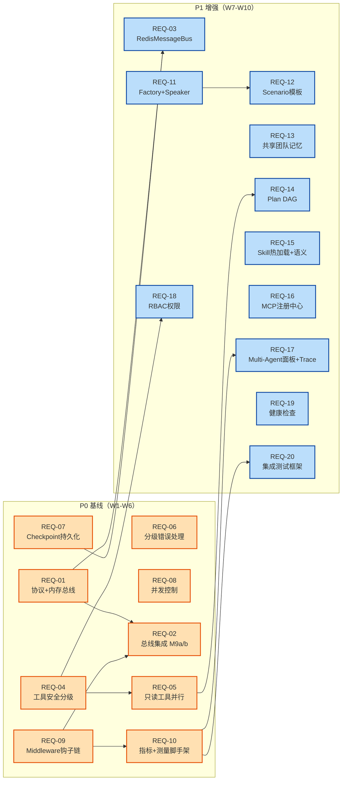

# v2.0 需求拆分总览（Requirements Overview）

> 配套：[`../12-iteration-plan-evaluation.md`](../12-iteration-plan-evaluation.md)（计划书评估）
>
> 来源：[`../11-production-grade-iteration-plan.md`](../11-production-grade-iteration-plan.md) 第 2 节需求清单（M1-M19、E1-E3、P1-P4、Q1，共 27 项）
>
> 拆分日期：2026-08-06

---

## 1. 拆分原则

1. **单一职责**：每个 REQ 文档对应一个可独立开发、独立测试、独立验收的最小交付单元。强耦合项（如 M1 协议 + M2 总线）合并为一个 REQ；可独立交付项（如 M9 集成）单列。
2. **依赖显式化**：每个 REQ 标注 `依赖` 与 `被依赖`，形成 DAG，确保可按拓扑序排期。
3. **现状对齐**：每个 REQ 标注 `关联 spec`，凡与 `.trae/specs/` 已有规格重叠的，明确"增量 vs 复用"边界（详见第 4 节）。
4. **评估修正落地**：第 9 节评估建议（R1-R10）已并入各 REQ 的工作量与范围，本表工作量≠计划书原值。
5. **可验收**：每个 REQ 含 Given/When/Then 验收标准，P0 项必须可在无 Q1 测试框架的情况下手工/脚本验证。

---

## 2. 需求清单总览（修正后）

| REQ | 标题 | 来源 | 优先级 | 工作量(修正) | 关联已有 spec | 依赖前置 |
|-----|------|------|--------|------------|--------------|---------|
| REQ-01 | AgentMessage 协议标准化 + InMemoryMessageBus | M1+M2 | P0 | 7d | — | — |
| REQ-02 | 消息总线与 AgentOrchestrator 集成 | M9 | P0 | 7d（拆 a/b） | — | REQ-01, REQ-09(软) |
| REQ-03 | RedisMessageBus（持久化 + Pub/Sub） | M17 | P1 | 4d | — | REQ-01, REQ-07 |
| REQ-04 | 工具安全分级与全量标注 | M3+M13 | P0 | 4d | mcp-multiagent-refactor（source/guard 同域） | — |
| REQ-05 | READ_ONLY 工具并行执行 | M12 | P0 | 3d | — | REQ-04 |
| REQ-06 | 分级错误处理与 ConversableAgent 集成 | M4+M10 | P0 | 7d | — | — |
| REQ-07 | Checkpoint 持久化与自动恢复 | M5+M11 | P0 | 4d（采纳 MysqlSaver） | — | — |
| REQ-08 | Agent 并发控制 | M6 | P0 | 2d | — | — |
| REQ-09 | AgentMiddleware 生命周期钩子链 | M7 | P0 | 4d | — | — |
| REQ-10 | Agent 级 Prometheus 指标 + 测量脚手架 | M8(+Q1基座) | P0 | 4d | platform-completeness-enhancement（Agents Tab） | REQ-09 |
| REQ-11 | AgentFactory + @AgentRole + 动态 Speaker | M14+M15 | P1 | 6d | —（AiAgentFactory 命名冲突） | — |
| REQ-12 | Scenario 模板机制 | M16 | P1 | 7d | — | REQ-11 |
| REQ-13 | 共享团队记忆 | M18 | P1 | 4d | — | — |
| REQ-14 | Plan DAG 化执行 | M19 | P1 | 3d | — | REQ-05 |
| REQ-15 | Skill 热加载 + 语义匹配 | E1+E2 | P1 | 6d | mcp-multiagent-refactor（SkillCatalog 增量） | mcp-multiagent-refactor |
| REQ-16 | MCP Server 注册中心管理 | E3 | P1 | 2d | mcp-multiagent-refactor（McpServerManager 增量） | mcp-multiagent-refactor |
| REQ-17 | Multi-Agent 运行面板 + 结构化 Trace | P1+P2 | P1 | 8d | platform-completeness-enhancement（admin Agents/Workflows Tab 增量） | REQ-10 |
| REQ-18 | RBAC 细粒度权限矩阵 | P3 | P1 | 4d | mcp-multiagent-refactor（ToolInvocationGuard 基座） | REQ-04 |
| REQ-19 | Agent 健康检查 | P4 | P1 | 2d | — | — |
| REQ-20 | Agent 集成测试框架（录制-回放） | Q1(去基座) | P1 | 5d | — | REQ-10 |

**工作量汇总（修正后）**：

| 类别 | P0 | P1 | 合计 |
|------|----|----|------|
| 人天 | 41d（含 REQ-10 测量脚手架 +2d、REQ-02 +2d；REQ-07 -1d） | 51d（REQ-12 +2d；REQ-15/16 收敛自 spec） | **92d** |

> 与计划书原值 91d 接近，但分布更合理：P0 增 2d（测量脚手架前置 + M9 缓冲），P1 减 1d（Skill/MCP 复用已有 spec）。缓冲 W11-13 不变。

---

## 3. 依赖关系图

**关键路径**：REQ-01 → REQ-02（M9 集成，最高风险，已拆 a/b 并 +2d）。
**测量闭环**：REQ-10（P0）提供指标采集 + 测量脚手架，使 P0 里程碑可客观验收，并供 REQ-17/REQ-20 复用。

---

## 4. 与已有 spec 的重叠调和矩阵

> 详见评估报告第 3 节。本表给出每个重叠 REQ 的"增量 vs 复用"判定。

| REQ | 已有 spec 已实现 | 本 REQ 的增量边界 | 判定 |
|-----|----------------|-----------------|------|
| REQ-04 | `ToolDefinition.source`（BUILTIN/MCP/SKILL）+ `ToolInvocationGuard` | 新增 `ToolSafetyLevel`（READ_ONLY/READ_WRITE/MUTATING）+ `@ToolMeta` 注解；`source` 与 `safety` 合并进统一 ToolDefinition 元数据 | **复用基座 + 增量维度** |
| REQ-15 | `SkillCatalogService` + `SkillExecutor` + `Skill` PO/Dao/表（V011） | 增量：DB/文件/URL 热加载 + 变更重载；语义匹配替代关键字 findRelevant | **完全增量，基于 spec 已有 Skill 系统** |
| REQ-16 | `McpServerManager` connect/disconnect/reconnect + 精确路由 | 增量：多 Server 动态注册/注销管理接口 + 状态面板 | **完全增量** |
| REQ-17 | admin `Workflows Tab` + `Agents Tab` + LLM Monitor `Agents 子 Tab` + NodeEvent SSE 轨迹 | 增量：Agent 间通信可视化 + 工具调用实时流 + NodeEvent→标准 Span 树（对接 TraceCollector） | **复用面板骨架 + 增量可视化与 Span 化** |
| REQ-18 | `ToolInvocationGuard`（工具级 userId 守卫）+ ToolRegistry 用户隔离 | 增量：Agent 使用权限 + 数据库访问权限（RBAC 矩阵，非工具级） | **复用 guard 基座 + 增量角色维度** |

**原则**：凡标注"复用基座"的 REQ，**禁止重新实现 spec 已覆盖的部分**；开发前先确认 spec 落地状态（spec 仍在 Drafting→待审批，需先推动其评审）。

---

## 5. 优先级与排期建议（修正后）

| 阶段 | 周次 | REQ | 里程碑判定标准（可客观验收） |
|------|------|-----|------------------------|
| Phase 7-A | W1 | REQ-01, REQ-04, REQ-08 | 消息类型单测全过；4 内置工具标注完成；Semaphore 集成测试过 |
| | W2 | REQ-06, REQ-07 | 4 级错误分类单测过；MysqlSaver 写入/读取测试过 |
| | W3 | REQ-09 | 8 钩子在 before/after init/act 正确触发 |
| Phase 7-B | W4 | REQ-10, REQ-02a | 6 指标暴露到 /actuator/prometheus；**测量脚手架可跑协作成功率**；总线旁路并行运行 |
| | W5 | REQ-02b, REQ-05 | 6-Agent 经总线通信零回归（旁路验证通过即达 P0 里程碑判定线）；READ 工具并行 |
| | W6 | 缓冲/切换收尾 | 总线切换完成或明确推迟到 W11；全部 P0 集成测试绿 |
| **P0 里程碑** | **W6 末** | — | **REQ-01/02a/04/05/06/07/08/09/10 全部验收，协作成功率可测量** |
| Phase 7-C | W7-W8 | REQ-15, REQ-16, REQ-19, REQ-03 | Skill 热加载 + MCP 管理 + 健康检查 + Redis 总线 |
| | W9 | REQ-11, REQ-17, REQ-18 | Factory+Speaker + 面板/Trace + RBAC |
| | W10 | REQ-12, REQ-13, REQ-14, REQ-20 | Scenario + 共享记忆 + DAG + 测试框架 |
| **P1 里程碑** | **W10 末** | — | 全部 P1 验收 |
| 稳定期 | W11-W13 | 集成测试 / 压测 / 灰度 / 文档 | — |

> 与计划书关键差异：①P0 里程碑判定线放宽为"REQ-02a 旁路通过"（吸收 M9 风险）；②REQ-10 含测量脚手架前置，使 P0 可客观验收；③REQ-15/16 复用 spec，释放的工时部分用于 REQ-12 +2d。

---

## 6. 验收门禁（Definition of Done）

每个 REQ 须同时满足：

1. **功能性**：全部 Given/When/Then 验收标准通过。
2. **回归**：`mvn -pl sql-logic-service test` 全绿（遵循项目约定：先 `mvn install -DskipTests` 整 reactor）。
3. **可观测**：P0 项须能在 /actuator/prometheus 或日志中观测到对应指标/事件。
4. **安全**：涉及工具调用/权限的 REQ（04/05/18）须通过 SecurityUtils/ToolInvocationGuard 测试。
5. **文档**：每个 REQ 交付时更新本 overview 的状态列与 `docs/` 下相关说明。
6. **依赖**：标注的"关联 spec"项须确认未与 spec 已实现部分冲突（grep 验证无重复类）。

---

## 7. 文档索引

| REQ | 文件 |
|-----|------|
| REQ-01 | [`REQ-01-agent-message-protocol-and-bus.md`](REQ-01-agent-message-protocol-and-bus.md) |
| REQ-02 | [`REQ-02-message-bus-orchestrator-integration.md`](REQ-02-message-bus-orchestrator-integration.md) |
| REQ-03 | [`REQ-03-redis-message-bus.md`](REQ-03-redis-message-bus.md) |
| REQ-04 | [`REQ-04-tool-safety-classification.md`](REQ-04-tool-safety-classification.md) |
| REQ-05 | [`REQ-05-readonly-tool-parallel-execution.md`](REQ-05-readonly-tool-parallel-execution.md) |
| REQ-06 | [`REQ-06-error-classification-and-retry.md`](REQ-06-error-classification-and-retry.md) |
| REQ-07 | [`REQ-07-checkpoint-persistence-and-recovery.md`](REQ-07-checkpoint-persistence-and-recovery.md) |
| REQ-08 | [`REQ-08-agent-concurrency-control.md`](REQ-08-agent-concurrency-control.md) |
| REQ-09 | [`REQ-09-agent-middleware-lifecycle.md`](REQ-09-agent-middleware-lifecycle.md) |
| REQ-10 | [`REQ-10-agent-prometheus-metrics.md`](REQ-10-agent-prometheus-metrics.md) |
| REQ-11 | [`REQ-11-agent-factory-and-speaker.md`](REQ-11-agent-factory-and-speaker.md) |
| REQ-12 | [`REQ-12-scenario-template.md`](REQ-12-scenario-template.md) |
| REQ-13 | [`REQ-13-shared-team-memory.md`](REQ-13-shared-team-memory.md) |
| REQ-14 | [`REQ-14-plan-dag-execution.md`](REQ-14-plan-dag-execution.md) |
| REQ-15 | [`REQ-15-skill-hot-loading-and-semantic-match.md`](REQ-15-skill-hot-loading-and-semantic-match.md) |
| REQ-16 | [`REQ-16-mcp-server-registry.md`](REQ-16-mcp-server-registry.md) |
| REQ-17 | [`REQ-17-multi-agent-dashboard-and-trace.md`](REQ-17-multi-agent-dashboard-and-trace.md) |
| REQ-18 | [`REQ-18-rbac-permission.md`](REQ-18-rbac-permission.md) |
| REQ-19 | [`REQ-19-agent-health-check.md`](REQ-19-agent-health-check.md) |
| REQ-20 | [`REQ-20-agent-integration-test-framework.md`](REQ-20-agent-integration-test-framework.md) |
